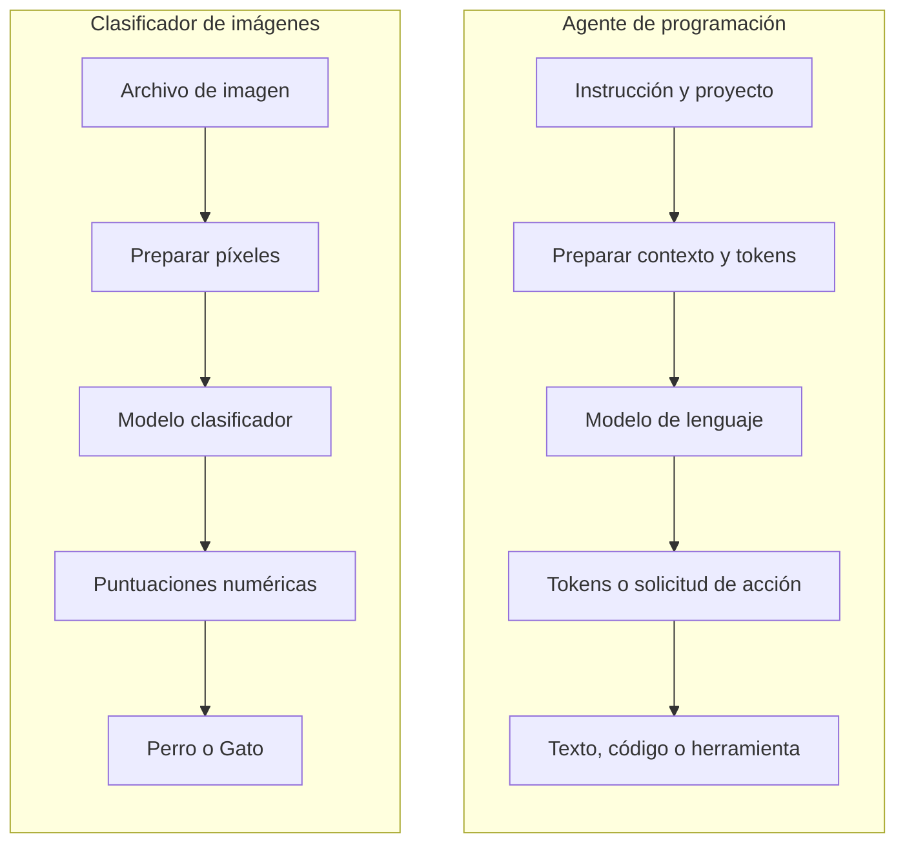
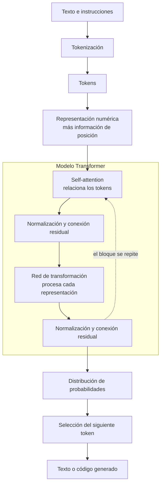
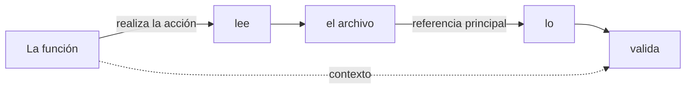
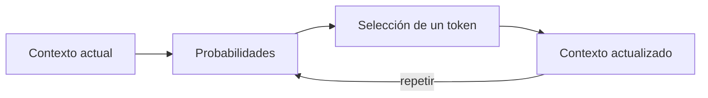
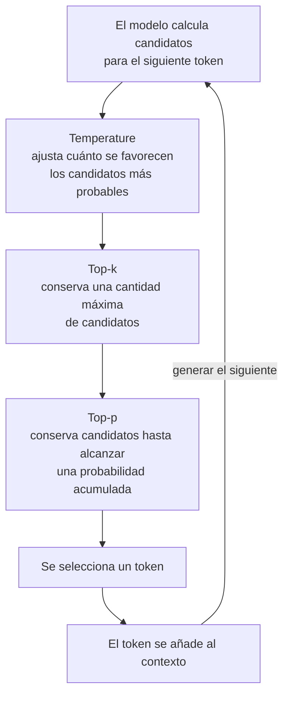
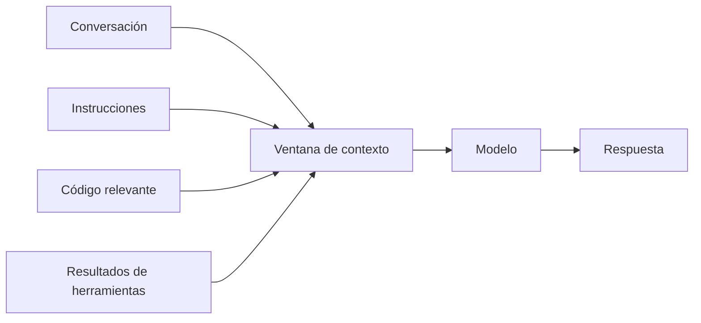
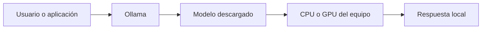

# Sesión 1 - Fundamentos de los modelos de IA y entornos locales

## 0.0 - Algo de ML y modelos

### Propósito

Antes de estudiar cómo funciona un modelo de lenguaje, necesitamos comprender algunas ideas básicas sobre inteligencia artificial, *machine learning* y modelos.

El objetivo de esta introducción no es profundizar en matemáticas ni estudiar diferentes tipos de *machine learning*. Buscamos construir un lenguaje común que nos permita entender qué es un modelo, cómo se obtiene y por qué sus resultados no deben interpretarse como verdades absolutas.

### Inteligencia artificial

La **inteligencia artificial (IA)** es un término general que utilizamos para describir sistemas informáticos capaces de realizar tareas que solemos relacionar con capacidades humanas, por ejemplo:

- Reconocer una imagen.
- Comprender o generar texto.
- Identificar patrones.
- Hacer predicciones.
- Recomendar una acción o contenido.

### Machine learning

El **machine learning (ML)** o aprendizaje automático es una forma de construir software en la que, en lugar de programar manualmente todas las reglas, proporcionamos datos y ejemplos para que un algoritmo encuentre patrones.

El sistema utiliza esos patrones para generar un modelo que posteriormente puede procesar información nueva y producir una predicción.

### Programación tradicional y machine learning

En un programa tradicional, una persona define las reglas que debe seguir el sistema:

```text
Reglas escritas por una persona + datos
                    ↓
                 Programa
                    ↓
                 Resultado
```

En *machine learning*, proporcionamos ejemplos con resultados conocidos para que un algoritmo encuentre patrones y genere el modelo:

```text
Datos de entrenamiento + resultados conocidos
                       ↓
              Algoritmo de entrenamiento
                       ↓
                     Modelo
```

Una vez entrenado, utilizamos el modelo con datos nuevos:

```text
Modelo + dato nuevo
          ↓
      Predicción
```

### Qué es un modelo

Un **modelo** es el resultado del proceso de entrenamiento. Representa los patrones que el algoritmo ha encontrado en los datos utilizados para entrenarlo.

Podemos verlo como una función que recibe información y produce una predicción:

```text
Entrada → modelo → predicción
```

En un clasificador de imágenes:

```text
Imagen nueva → modelo → "perro" o "gato"
```

El modelo no conoce un perro o un gato como lo hace una persona. Su predicción se basa en los patrones que aprendió observando los ejemplos de entrenamiento.

### Datos de entrenamiento

Los **datos de entrenamiento** son los ejemplos que proporcionamos al algoritmo para construir el modelo.

En un clasificador de perros y gatos podemos utilizar:

```text
imagen-perro-01.jpg → perro
imagen-perro-02.jpg → perro
imagen-gato-01.jpg  → gato
imagen-gato-02.jpg  → gato
```

Cada imagen es un dato de entrada y `perro` o `gato` es el resultado conocido que asociamos al ejemplo.

La calidad de un modelo depende, entre otros factores, del algoritmo utilizado y de los datos con los que ha sido entrenado. Importan la cantidad de ejemplos, su calidad, su variedad y que representen adecuadamente las situaciones en las que utilizaremos el modelo.

### Entrenamiento y uso del modelo

Conviene diferenciar dos momentos:

1. **Entrenamiento:** el algoritmo procesa los ejemplos, identifica patrones y genera el modelo.
2. **Predicción o inferencia:** utilizamos el modelo ya entrenado para procesar un dato nuevo.

```text
Ejemplos conocidos → entrenamiento → modelo

Dato nuevo → modelo entrenado → predicción
```

### Resultados probabilísticos

Los modelos de *machine learning* producen predicciones basadas en patrones estadísticos. Por eso sus resultados no deben interpretarse como reglas infalibles ni como verdades absolutas.

Un clasificador puede expresar su predicción mediante niveles de confianza:

```text
Perro: 78 %
Gato:  22 %
```

El modelo puede acertar, mostrar dudas o equivocarse. Su comportamiento estará condicionado por lo que aprendió durante el entrenamiento y por la información que reciba posteriormente.

### Recursos opcionales para profundizar

Esta introducción presenta solamente los conceptos necesarios para continuar con la formación. Quienes deseen estudiar *machine learning* con mayor profundidad pueden consultar los siguientes recursos externos:

- [Complete A.I. & Machine Learning, Data Science Bootcamp](https://www.udemy.com/share/102vBw3@1K3A-YGLP90_wh3WHoD3JnxMsnl_eJ8mC_hVxrLqh0uNNCdmCHgnW4HvEdDmUprIzQ==/), de Andrei Neagoie y Daniel Bourke: formación extensa para profundizar en inteligencia artificial, *machine learning* y ciencia de datos. Es un curso de Udemy, por lo que requiere una cuenta y la adquisición del curso; no es un recurso gratuito.
- [Curso: Introducción a Machine Learning, de Ligdi Gonzalez](https://www.youtube.com/playlist?list=PLJjOveEiVE4Cbbx1dVjydfmPPpjl0pg86): playlist completamente gratuita disponible en YouTube para continuar estudiando los conceptos introductorios.

## 0.1 - Demostración: entrenar un clasificador de imágenes

Utilizaremos [Teachable Machine](https://teachablemachine.withgoogle.com/), una herramienta web gratuita que permite entrenar modelos sencillos sin escribir código.

### Objetivo de la demostración

Crear un modelo que reciba una imagen y trate de clasificarla como `Perro` o `Gato`.

La demostración nos permitirá observar de forma directa:

- La relación entre datos, entrenamiento, modelo y predicción.
- Cómo se definen las categorías que el modelo debe reconocer.
- Cómo se utilizan ejemplos para entrenarlo.
- Cómo responde ante una imagen que no utilizamos durante el entrenamiento.
- Que el modelo puede acertar, mostrar distintos niveles de confianza o equivocarse.

## 0.2 - Demostración: diferentes algoritmos, diferentes resultados

Utilizaremos [Machine Learning Playground](https://ml-playground.com/#), una herramienta interactiva que permite observar cómo distintos algoritmos clasifican los mismos datos.

### Objetivo de la demostración

Mostrar visualmente que podemos entrenar diferentes modelos para resolver un mismo problema y que cada uno puede separar o clasificar los datos de una manera distinta.

La intención no es estudiar el funcionamiento interno de cada algoritmo. Utilizaremos la herramienta para construir una intuición sencilla:

> Un mismo conjunto de datos puede producir modelos con comportamientos diferentes dependiendo del algoritmo y de la configuración utilizados.

La herramienta permite comparar alternativas como K-Nearest Neighbors, Perceptron, Support Vector Machine, red neuronal artificial y árbol de decisión. En esta introducción solo observaremos sus resultados; no profundizaremos en la teoría de cada algoritmo.

### Pasos de alto nivel

1. Abrir [Machine Learning Playground](https://ml-playground.com/#).
2. Dibujar varios puntos de dos categorías en el área de trabajo.
3. Elegir uno de los algoritmos disponibles.
4. Entrenar el modelo y observar cómo divide el espacio para clasificar los puntos.
5. Mantener los mismos datos y seleccionar otro algoritmo.
6. Comparar las diferentes fronteras de clasificación.
7. Agregar algunos puntos más o cambiar su distribución.
8. Observar cómo reaccionan los modelos ante los cambios.

## 0.3 - De los datos a las predicciones

Los modelos que hemos utilizado en las demostraciones y los modelos de lenguaje empleados por herramientas como Claude Code, Codex o ChatGPT comparten una idea general: reciben datos representados numéricamente, aplican patrones aprendidos durante el entrenamiento y producen una predicción.

Sin embargo, se han entrenado para problemas y alcances muy diferentes.

### Del archivo de imagen al clasificador

El modelo de Teachable Machine no recibe una imagen como la percibe una persona. Antes de utilizarla, la aplicación debe realizar varias operaciones mediante software convencional:

```text
Archivo de imagen
→ leer y decodificar sus bytes
→ obtener los valores de sus píxeles
→ ajustar el tamaño y normalizar los valores
→ construir una matriz numérica
→ entregar esa matriz al modelo
```

El modelo tampoco devuelve directamente las palabras `Perro` o `Gato`. Internamente puede producir puntuaciones numéricas para las categorías que conoce:

```text
[0.82, 0.18]
→ Perro: 82 %
→ Gato: 18 %
```

La aplicación relaciona cada posición de la salida con su etiqueta y presenta un resultado comprensible para el usuario.

El flujo completo queda dividido en tres partes:

```text
Preparación de la entrada mediante software convencional
→ modelo entrenado
→ interpretación y presentación del resultado
```

### Del texto humano al modelo de lenguaje

Los modelos de lenguaje siguen un esquema comparable. No reciben directamente las palabras como las interpreta una persona. La aplicación prepara la información y convierte el texto en unidades numéricas que el modelo puede procesar.

```text
Instrucción del usuario
→ preparación del contexto
→ conversión del texto en tokens
→ representación numérica
→ modelo de lenguaje
→ generación de nuevos tokens
→ conversión de los tokens a texto
→ respuesta para el usuario
```

La preparación del contexto puede reunir:

- La instrucción escrita por el usuario.
- Las instrucciones internas de la herramienta.
- El historial de la conversación.
- Archivos y fragmentos de código del proyecto.
- La descripción de las herramientas disponibles.
- Resultados obtenidos al ejecutar comandos o consultar otros sistemas.

### Diferencia de alcance

El clasificador de la demostración ha sido preparado para resolver una tarea concreta:

```text
Imagen → clasificar como Perro o Gato
```

No sabe escribir código, traducir un texto o interpretar una instrucción porque no fue entrenado para esas tareas y su entrada y salida fueron diseñadas para otro problema.

Los grandes modelos de lenguaje han sido entrenados con cantidades muy superiores de texto, código y otros contenidos. Durante ese proceso, que requiere un coste computacional muy elevado, aprenden una enorme variedad de patrones lingüísticos y técnicos.

Esto les permite trabajar con tareas mucho más generales, por ejemplo:

- Interpretar instrucciones expresadas en lenguaje natural.
- Generar y explicar código.
- Relacionar información de diferentes archivos.
- Traducir o reformular contenido.
- Identificar patrones frecuentes en errores de software.
- Proponer acciones a partir del contexto disponible.

### El modelo y la herramienta agéntica no son lo mismo

Claude Code y Codex no son solamente una caja de texto conectada a un modelo. Son herramientas que preparan el contexto, permiten acceder a archivos y comandos, se comunican con el modelo y procesan sus respuestas.

```text
Desarrollador
→ herramienta agéntica
→ preparación de contexto y tokens
→ modelo de lenguaje
→ texto o solicitud de una acción
→ herramienta agéntica
→ respuesta, modificación de archivos o ejecución de comandos
```

El modelo genera decisiones y respuestas a partir de los patrones aprendidos. La herramienta que lo rodea ejecuta mediante software convencional acciones como leer un archivo, modificar código, lanzar pruebas o devolver el resultado al usuario.

### Comparación visual



En los siguientes apartados profundizaremos en cómo el texto se divide en tokens y cómo el modelo de lenguaje relaciona el contexto para generar una respuesta.

## 1.0 - Introducción a la arquitectura Transformer

### ¿Qué es un Transformer?

Un **Transformer** es una arquitectura de red neuronal diseñada para trabajar con secuencias de información, como una frase, un fragmento de código o una conversación.

Fue presentada en 2017 en el artículo [*Attention Is All You Need*](https://research.google/pubs/attention-is-all-you-need/). Su principal aportación fue utilizar la **atención** como mecanismo central para relacionar los elementos de una secuencia, sin depender de procesarlos estrictamente uno detrás de otro como hacían arquitecturas anteriores.

En lenguaje sencillo, esta arquitectura permite que el modelo examine los tokens de un contexto y determine cuáles son relevantes para interpretar cada parte. Así puede relacionar, por ejemplo:

- Una variable con el lugar donde fue declarada.
- Una función con la instrucción que solicita modificarla.
- Un pronombre con el concepto al que hace referencia.
- Una pregunta con información aparecida antes en la conversación.

El Transformer no contiene reglas escritas manualmente para reconocer esas relaciones. Durante el entrenamiento ajusta una gran cantidad de valores internos y aprende patrones a partir de los ejemplos que ha procesado.

### ¿Por qué se llama Transformer?

El nombre **Transformer** puede entenderse como una referencia a su función: recibe una secuencia representada numéricamente y la va **transformando** a través de varias capas. Cada capa produce una representación más enriquecida por el contexto hasta que el modelo puede generar una salida.

No significa que el texto pase por varios modelos independientes. Las capas de atención y transformación forman parte de la arquitectura interna de un mismo modelo y, normalmente, son transparentes para quien utiliza ChatGPT, Claude Code o Codex.

```text
Tokens de entrada
→ representaciones numéricas iniciales
→ transformaciones sucesivas con contexto
→ probabilidades para el siguiente token
```

### La arquitectura original y los modelos generativos

El Transformer presentado originalmente estaba formado por dos grandes componentes:

- **Encoder:** construía una representación contextual de la secuencia de entrada.
- **Decoder:** utilizaba esa representación y los elementos ya generados para producir la secuencia de salida.

Esta organización era especialmente útil para tareas como traducir un texto de un idioma a otro.

Muchos modelos generativos actuales utilizan una variante denominada **decoder-only**. Conservan los bloques fundamentales del Transformer, pero están organizados para predecir repetidamente el siguiente token a partir de los tokens anteriores. Este es el esquema más relevante para entender, a alto nivel, cómo un modelo genera texto o código.

### Vista simplificada de un modelo generativo

El siguiente gráfico no representa todos los detalles matemáticos. Muestra el recorrido conceptual de la información y el bloque Transformer que se repite muchas veces dentro de un modelo real.



En una generación real, el modelo añade el token elegido al contexto y vuelve a ejecutar el proceso para obtener el siguiente. La respuesta se construye de esta manera, token a token, hasta que se alcanza una condición de finalización.

## 1.1 - Self-attention: relacionar los tokens

Un **token** es una unidad en la que el sistema divide el texto. Puede ser una palabra completa, una parte de una palabra o un signo. El modelo no analiza cada token de forma aislada: necesita relacionarlo con los demás para interpretar el contexto.

**Self-attention** es el mecanismo que permite que cada token tenga en cuenta otros tokens de la misma secuencia y determine cuáles son más relevantes para representarlo.

Por ejemplo:

> La función lee el archivo y después lo valida.

Para interpretar `lo`, el modelo necesita relacionarlo principalmente con `archivo`. También puede reconocer que `lee` y `valida` son acciones realizadas por `función`. Estas relaciones no se programan una por una; el modelo aprende patrones durante su entrenamiento.



La importancia de cada relación se representa mediante valores numéricos. Cuanto más relevante resulte un token para interpretar otro, mayor influencia tendrá en su representación contextual.

Este análisis ocurre dentro de las capas del Transformer. No es un paso manual ni un modelo independiente situado antes del modelo de lenguaje.

Gracias a este mecanismo, el modelo puede relacionar elementos alejados dentro de una instrucción, una conversación o un archivo de código. Aun así, está limitado por la información incluida en su contexto y por los patrones aprendidos durante el entrenamiento.

## 1.2 - Predicción del siguiente token

Después de relacionar los tokens mediante self-attention, el modelo utiliza el contexto resultante para calcular qué token podría aparecer a continuación. No produce toda la respuesta de una sola vez: asigna probabilidades a diferentes candidatos, selecciona uno y repite el proceso.

```text
El lenguaje utilizado en este proyecto es...

Python      65 %
Java        20 %
TypeScript  10 %
Otros        5 %
```

Estos porcentajes son un ejemplo simplificado. La selección depende del contexto y de la configuración utilizada durante la generación. El token elegido se añade a la secuencia y pasa a formar parte del contexto para calcular el siguiente.



Por eso un modelo puede generar respuestas diferentes ante una misma instrucción. También explica por qué una respuesta fluida o un token muy probable no garantizan que la información sea correcta.

## 1.3 - Parámetros de inferencia

Los parámetros de inferencia permiten controlar cómo se selecciona el siguiente token. No cambian lo que el modelo aprendió durante su entrenamiento; modifican el grado de variedad permitido al generar una respuesta.

### `temperature`: controlar la variación

- Una temperatura **baja** favorece los tokens más probables y produce respuestas más estables.
- Una temperatura **alta** reparte más las posibilidades y genera respuestas más variadas, pero también puede aumentar los errores.

Para tareas como completar o modificar código suele ser conveniente una variación baja. Para proponer ideas pueden explorarse valores más altos.

### `top-k`: limitar la cantidad de candidatos

Conserva únicamente los `k` tokens con mayor probabilidad. Por ejemplo, `top-k = 5` permite elegir entre los cinco candidatos principales y descarta el resto.

### `top-p`: limitar por probabilidad acumulada

Conserva el grupo más pequeño de candidatos cuya probabilidad conjunta alcanza el valor indicado. Por ejemplo, `top-p = 0.9` permite considerar candidatos hasta reunir aproximadamente el 90 % de la probabilidad.



Este recorrido es una representación conceptual. Los parámetros pueden utilizarse por separado o combinarse, y su disponibilidad depende del modelo y de la herramienta utilizada.

En resumen: `temperature` controla la variación, `top-k` limita cuántos candidatos participan y `top-p` limita cuánta probabilidad conjunta se considera.

En herramientas como Codex o GitHub Copilot estos parámetros suelen gestionarse internamente y no se muestran al usuario. Cuando utilizamos una API compatible o un modelo local con Ollama, normalmente tenemos más control sobre su configuración.

## 1.4 - Ventana de contexto

La **ventana de contexto** es la cantidad máxima de información que el modelo puede considerar al generar una respuesta. Se mide en tokens e incluye tanto la entrada como la salida generada.

En una herramienta agéntica, el contexto puede contener:

- La instrucción del usuario y el historial reciente.
- Las reglas configuradas para el agente.
- Archivos o fragmentos de código relevantes.
- Resultados de comandos y herramientas.



La ventana tiene un límite. Si la información disponible lo supera, la herramienta debe seleccionar, resumir o descartar parte del contenido. Por eso el modelo no está observando necesariamente todo el repositorio ni conserva una memoria permanente de conversaciones anteriores.

### *Lost in the Middle*

Tener una ventana grande no garantiza que toda la información influya de la misma manera. El fenómeno [*Lost in the Middle*](https://aclanthology.org/2024.tacl-1.9/) describe cómo algunos modelos aprovechan peor la información relevante cuando queda enterrada en medio de un contexto extenso.

Para reducir este problema conviene:

- Incluir únicamente el contexto necesario.
- Escribir las instrucciones y restricciones de forma clara.
- Dividir tareas muy grandes en pasos manejables.
- Indicar expresamente qué archivos o datos son importantes.

En las APIs, una entrada más extensa normalmente implica más tokens procesados, mayor coste y más tiempo de respuesta. Añadir contexto resulta útil cuando aporta información relevante; incluir contenido sin criterio puede dificultar el trabajo del modelo.

## 1.5 - Consumo y coste de tokens

Cuando utilizamos una API, el consumo suele dividirse en:

- **Tokens de entrada:** instrucciones, historial, código y demás contexto enviado al modelo.
- **Tokens de salida:** respuesta, código o decisiones generadas por el modelo.

Cada proveedor establece sus tarifas y puede cobrar precios diferentes por la entrada y la salida. Para estimar el coste se aplica la tarifa correspondiente a cada grupo:

```text
Coste total =
(tokens de entrada ÷ 1 000 000 × precio de entrada)
+
(tokens de salida ÷ 1 000 000 × precio de salida)
```

### Ejemplo hipotético

Supongamos una tarifa de `1 €` por millón de tokens de entrada y `4 €` por millón de tokens de salida:

| Consumo | Cálculo | Coste |
|---|---:|---:|
| 10 000 tokens de entrada | `10 000 ÷ 1 000 000 × 1 €` | `0,010 €` |
| 2 000 tokens de salida | `2 000 ÷ 1 000 000 × 4 €` | `0,008 €` |
| **Total** | | **0,018 €** |

Las cifras son únicamente didácticas y no representan la tarifa de un proveedor concreto.

Una herramienta agéntica puede llamar al modelo varias veces para analizar archivos, decidir una acción, interpretar resultados y corregir errores. El consumo real de una tarea es la suma de todas esas llamadas, no solamente el texto visible al final.

Para reducir consumo innecesario conviene proporcionar contexto relevante, evitar archivos que no aportan información y cerrar o resumir conversaciones que han crecido demasiado.

## 1.6 - Modelos locales con Ollama

Hasta ahora hemos hablado de modelos ejecutados por proveedores en la nube. También podemos descargar un modelo y ejecutarlo en nuestro propio equipo.

**Ollama** es una herramienta que facilita la descarga, administración y ejecución de modelos. Podemos interactuar con ellos desde la terminal o mediante una API local.



| Modelo en la nube | Modelo local |
|---|---|
| Se ejecuta en la infraestructura del proveedor | Se ejecuta en nuestro equipo |
| Requiere conexión al servicio | Puede funcionar sin conexión después de descargarlo |
| El proveedor administra el hardware | El rendimiento depende de nuestro hardware |
| Puede cobrarse por uso | No tiene coste por llamada, pero utiliza recursos locales |

Ejecutar un modelo local ofrece más control y permite experimentar con parámetros como `temperature`. Sin embargo, los modelos ocupan espacio en disco y su velocidad depende de la memoria, la CPU, la GPU y el tamaño del modelo elegido.

Antes de instalar Ollama comprobaremos el sistema operativo, el espacio disponible y las características del equipo. Después instalaremos la herramienta, descargaremos un modelo orientado a código y realizaremos nuestra primera prueba desde la terminal.

## 1.7 - Instalación y verificación de Ollama

Ollama está disponible para Windows, macOS y Linux. Antes de instalarlo, revisa los requisitos actuales y descarga la versión correspondiente desde la [documentación oficial](https://docs.ollama.com/quickstart).

### Windows y macOS

1. Descargar el instalador desde [ollama.com/download](https://ollama.com/download).
2. Ejecutarlo y abrir la aplicación.
3. Cerrar y volver a abrir la terminal para que reconozca el comando.

### Linux

Ejecutar el instalador oficial desde la terminal:

```bash
curl -fsSL https://ollama.com/install.sh | sh
```

### Comprobar la instalación

Abrir una terminal nueva y ejecutar:

```bash
ollama --version
```

Si aparece la versión instalada, el comando está disponible correctamente. También podemos verificar que el servicio responde.

En Windows PowerShell:

```powershell
Invoke-RestMethod http://localhost:11434/api/version
```

En macOS o Linux:

```bash
curl http://localhost:11434/api/version
```

### Problemas frecuentes

- **No se reconoce `ollama`:** cerrar y abrir la terminal después de instalar.
- **No responde el servicio:** abrir la aplicación en Windows o macOS; en Linux, comprobar que el servicio está iniciado.
- **Falta espacio:** los modelos se descargan por separado y pueden ocupar varios gigabytes.

Los modelos se guardan normalmente en la carpeta `.ollama` del usuario en Windows y macOS, y en el directorio administrado por el servicio de Ollama en Linux. La ubicación puede cambiarse mediante la configuración de la herramienta.

## 1.8 - Elegir un modelo con `llmfit`

No todos los equipos pueden ejecutar los mismos modelos con la misma velocidad. [`llmfit`](https://github.com/AlexsJones/llmfit) detecta la RAM, CPU y GPU del ordenador, y recomienda modelos según su tamaño y el rendimiento estimado.

### Instalación

En Windows con [Scoop](https://scoop.sh/):

```powershell
scoop install llmfit
```

En macOS o Linux con Homebrew:

```bash
brew install AlexsJones/llmfit/llmfit
```

### Analizar el equipo

Para abrir la interfaz interactiva:

```bash
llmfit
```

### Opción recomendada para programación

Para obtener directamente tres modelos compatibles con el equipo y orientados a programación, copia y ejecuta:

```bash
llmfit recommend -n 3 --use-case coding --min-fit good
```

La respuesta se muestra en formato JSON. Cada recomendación contiene muchos datos, pero para esta práctica nos interesan principalmente:

- `name`: nombre completo del modelo.
- `ollama_name`: nombre que debemos utilizar en Ollama.
- `disk_size_gb`: espacio aproximado que ocupará la descarga.
- `memory_required_gb`: memoria estimada para ejecutarlo.
- `estimated_tps`: velocidad estimada en tokens por segundo.
- `fit_label`: nivel de compatibilidad con el equipo.

Ejemplo reducido de una recomendación:

```json
{
  "name": "Qwen/Qwen2.5-Coder-1.5B-Instruct",
  "ollama_name": "qwen2.5-coder:1.5b",
  "disk_size_gb": 1.62,
  "memory_required_gb": 2.34,
  "estimated_tps": 42.8,
  "fit_label": "Good"
}
```

Si `ollama_name` aparece como `null`, esa recomendación no tiene un nombre asociado para descargarla directamente desde Ollama.

### Obtener un comando de Ollama listo para copiar en PowerShell

Este comando busca la primera recomendación que tiene `ollama_name` y construye el comando necesario para ejecutarla:

```powershell
$modelo = (llmfit recommend -n 10 --use-case coding --min-fit good | ConvertFrom-Json).models |
    Where-Object { $_.ollama_name } |
    Select-Object -First 1 -ExpandProperty ollama_name
"ollama run $modelo"
```

La salida será similar a esta:

```text
ollama run qwen2.5-coder:1.5b
```

Que aparezca una sola recomendación es normal: no todos los modelos del catálogo de `llmfit` están disponibles directamente en Ollama.

### Preparar el comando de Ollama

Copia el valor de `ollama_name` y sustituye únicamente `NOMBRE_DEL_MODELO`:

```bash
ollama run NOMBRE_DEL_MODELO
```

Con la recomendación del ejemplo, el comando queda así:

```bash
ollama run qwen2.5-coder:1.5b
```

Antes de ejecutarlo, revisa `disk_size_gb` para confirmar que tienes espacio suficiente.

La herramienta compara el hardware con su catálogo y estima qué modelos deberían funcionar bien. El resultado sirve como orientación: el rendimiento real también depende de la cuantización, el tamaño del contexto y las aplicaciones que estén utilizando memoria al mismo tiempo.

Después elegiremos una de las recomendaciones disponible en Ollama, revisaremos su tamaño antes de descargarla y realizaremos una prueba real en el equipo.

## 1.9 - Descargar y ejecutar el modelo

Ejecuta el comando generado en el apartado anterior. Ollama descargará el modelo la primera vez y abrirá una conversación en la terminal.

```bash
ollama run qwen2.5-coder:1.5b
```

### Primera interacción

Utilizaremos JavaScript puro para poder probar el resultado directamente en el navegador, sin instalar herramientas adicionales. Envía esta instrucción al modelo:

```text
Escribe una función en JavaScript llamada obtenerPares que reciba un array de números y devuelva únicamente los números pares. Incluye un ejemplo con console.log y no utilices librerías externas.
```

Para comprobar la respuesta:

1. Abrir las herramientas de desarrollo del navegador con `F12`.
2. Seleccionar la pestaña **Consola** o **Console**.
3. Copiar y pegar el código generado.
4. Pulsar `Enter` y comprobar el resultado.

Para una entrada como `[1, 2, 3, 4, 5, 6]`, esperamos obtener:

```javascript
[2, 4, 6]
```

Además de ejecutar el código, revisa si el modelo cumplió el nombre solicitado, evitó dependencias y añadió un ejemplo válido. Una respuesta que parece correcta debe verificarse antes de utilizarla.

Para cerrar la conversación con el modelo:

```text
/bye
```

Para consultar los modelos descargados:

```bash
ollama ls
```

## 1.10 - Comprobar el uso del hardware

Con el modelo todavía activo, abre una segunda terminal y ejecuta:

```bash
ollama ps
```

La columna `PROCESSOR` indica dónde se ha cargado el modelo:

- `100% GPU`: se ejecuta completamente en la GPU.
- `100% CPU`: se ejecuta utilizando la memoria del sistema.
- Un porcentaje combinado: utiliza CPU y GPU.

El resultado puede ser diferente en cada equipo. Compararlo permite entender por qué un mismo modelo responde más rápido para unas personas que para otras.

## 1.11 - Taller: comparar `temperature`

Ejecutaremos la misma instrucción varias veces para observar cómo cambia la respuesta. Dentro de la conversación de Ollama, activa primero las estadísticas:

```text
/set verbose
```

### Prueba con baja variación

Configura la temperatura:

```text
/set parameter temperature 0.0
```

Antes de cada ejecución, limpia el historial de la conversación:

```text
/clear
```

Después copia y ejecuta siempre la misma instrucción:

```text
Escribe una función en JavaScript llamada obtenerParesSinRepetidos que reciba un array de números, elimine los valores repetidos y devuelva únicamente los números pares conservando su orden original. Incluye un ejemplo con console.log y no utilices librerías externas.
```

Repite la prueba tres veces, utilizando `/clear` antes de cada intento.

### Prueba con mayor variación

Cambia la temperatura:

```text
/set parameter temperature 1.5
```

Ejecuta tres veces la misma instrucción anterior y utiliza `/clear` antes de cada intento.

Prueba cada respuesta en la consola del navegador. Para una entrada como `[1, 2, 2, 3, 4, 4, 6]`, el resultado esperado es:

```javascript
[2, 4, 6]
```

Una temperatura baja suele producir respuestas más estables. Una temperatura alta permite mayor variedad, pero puede aumentar las diferencias y los errores. Ningún valor garantiza que el código sea correcto: siempre debemos ejecutarlo y revisarlo.

> **¿Qué buscamos al variar la temperatura?**
>
> La temperatura no hace que el modelo sea más o menos inteligente ni modifica lo que aprendió. Una temperatura baja favorece la solución que el modelo considera más probable; una temperatura alta permite explorar alternativas menos habituales que podrían encajar mejor en algunos problemas.
>
> Para implementar o corregir código suele convenir una temperatura baja. Para proponer enfoques, nombres, diseños o alternativas puede resultar útil aumentar la variedad. Una respuesta diferente no es necesariamente peor, pero siempre debe evaluarse en función de los requisitos y comprobarse mediante pruebas.

## 1.12 - Ejemplo de resultados

Estas dos respuestas fueron generadas por el mismo modelo utilizando la misma instrucción.

### Resultado con `temperature = 0.0`

```javascript
function obtenerParesSinRepetidos(array) {
    // Filtra los números pares
    const pares = array.filter(num => num % 2 === 0);

    // Elimina los valores repetidos
    const paresSinRepetidos = [...new Set(pares)];

    return paresSinRepetidos;
}

// Ejemplo de uso
const numeros = [1, 2, 3, 4, 5, 6, 7, 8, 9, 10];
const pares = obtenerParesSinRepetidos(numeros);
console.log(pares); // [2, 4, 6, 8, 10]
```

La solución separa el problema en dos pasos sencillos y conserva el orden original de los números.

### Resultado con `temperature = 1.5`

```javascript
function obtenerParesSinRepetidos(numeros) {
    const pares = new Set();

    for (const numero of numeros) {
        if (numero % 2 === 0) {
            pares.add(numero);
        }
    }

    return Array.from(pares).sort((a, b) => a - b);
}

// Ejemplo de uso
const numeros = [1, 2, 3, 4, 5, 6, 6, 7, 8, 9, 10];
const paresSinRepetidos = obtenerParesSinRepetidos(numeros);
console.log(paresSinRepetidos); // [2, 4, 6, 8, 10]
```

Esta solución también funciona con el ejemplo utilizado, pero añade una ordenación que no fue solicitada. Con una entrada como `[6, 2, 4, 2]`, devolvería `[2, 4, 6]` en lugar de conservar el orden esperado: `[6, 2, 4]`.

El ejemplo muestra por qué no basta con comprobar que el código se ejecuta. También debemos verificar que respeta todos los requisitos. La mayor temperatura permitió explorar otra implementación válida en parte, pero introdujo una decisión adicional que cambió el comportamiento solicitado.

Al terminar, compara con el grupo:

- Qué configuración produjo respuestas más parecidas.
- Qué soluciones funcionaron realmente en el navegador.
- Qué equipo obtuvo mayor velocidad de generación.
- Si una respuesta más extensa también fue más útil.

### Detener o eliminar el modelo

Para liberar el modelo de la memoria:

```bash
ollama stop NOMBRE_DEL_MODELO
```

Para eliminarlo del disco cuando ya no sea necesario:

```bash
ollama rm NOMBRE_DEL_MODELO
```

Por ejemplo:

```bash
ollama stop qwen2.5-coder:1.5b
```

Eliminar un modelo es opcional. Si se elimina, Ollama tendrá que descargarlo de nuevo para volver a utilizarlo.

## Ejercicio propuesto

Completa el ejercicio [Experimentar con un modelo local](./ejercicio/README.md) y entrega los resultados desde tu fork mediante un pull request.
