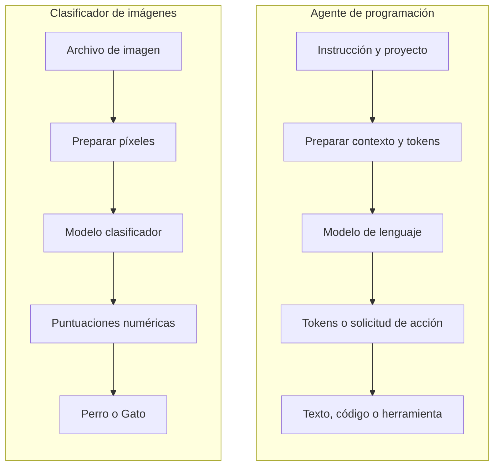

# Sesión 1 - Fundamentos de los modelos de IA y entornos locales

> Documento en construcción. El contenido de esta sesión se incorporará progresivamente.

## 0.0 - Algo de ML y modelos

### Propósito

Antes de estudiar cómo funciona un modelo de lenguaje, necesitamos comprender algunas ideas básicas sobre inteligencia artificial, *machine learning* y modelos.

El objetivo de esta introducción no es profundizar en matemáticas ni estudiar diferentes tipos de *machine learning*. Buscamos construir un lenguaje común que nos permita entender qué es un modelo, cómo se obtiene y por qué sus resultados no deben interpretarse como verdades absolutas.

### Inteligencia artificial

La **inteligencia artificial (IA)** es un término general que utilizamos para describir sistemas informáticos capaces de realizar tareas que solemos relacionar con capacidades humanas, por ejemplo:

- Reconocer una imagen.
- Comprender o generar texto.
- Identificar patrones.
- Hacer predicciones.
- Recomendar una acción o contenido.

### Machine learning

El **machine learning (ML)** o aprendizaje automático es una forma de construir software en la que, en lugar de programar manualmente todas las reglas, proporcionamos datos y ejemplos para que un algoritmo encuentre patrones.

El sistema utiliza esos patrones para generar un modelo que posteriormente puede procesar información nueva y producir una predicción.

### Programación tradicional y machine learning

En un programa tradicional, una persona define las reglas que debe seguir el sistema:

```text
Reglas escritas por una persona + datos
                    ↓
                 Programa
                    ↓
                 Resultado
```

En *machine learning*, proporcionamos ejemplos con resultados conocidos para que un algoritmo encuentre patrones y genere el modelo:

```text
Datos de entrenamiento + resultados conocidos
                       ↓
              Algoritmo de entrenamiento
                       ↓
                     Modelo
```

Una vez entrenado, utilizamos el modelo con datos nuevos:

```text
Modelo + dato nuevo
          ↓
      Predicción
```

### Qué es un modelo

Un **modelo** es el resultado del proceso de entrenamiento. Representa los patrones que el algoritmo ha encontrado en los datos utilizados para entrenarlo.

Podemos verlo como una función que recibe información y produce una predicción:

```text
Entrada → modelo → predicción
```

En un clasificador de imágenes:

```text
Imagen nueva → modelo → "perro" o "gato"
```

El modelo no conoce un perro o un gato como lo hace una persona. Su predicción se basa en los patrones que aprendió observando los ejemplos de entrenamiento.

### Datos de entrenamiento

Los **datos de entrenamiento** son los ejemplos que proporcionamos al algoritmo para construir el modelo.

En un clasificador de perros y gatos podemos utilizar:

```text
imagen-perro-01.jpg → perro
imagen-perro-02.jpg → perro
imagen-gato-01.jpg  → gato
imagen-gato-02.jpg  → gato
```

Cada imagen es un dato de entrada y `perro` o `gato` es el resultado conocido que asociamos al ejemplo.

La calidad de un modelo depende, entre otros factores, del algoritmo utilizado y de los datos con los que ha sido entrenado. Importan la cantidad de ejemplos, su calidad, su variedad y que representen adecuadamente las situaciones en las que utilizaremos el modelo.

### Entrenamiento y uso del modelo

Conviene diferenciar dos momentos:

1. **Entrenamiento:** el algoritmo procesa los ejemplos, identifica patrones y genera el modelo.
2. **Predicción o inferencia:** utilizamos el modelo ya entrenado para procesar un dato nuevo.

```text
Ejemplos conocidos → entrenamiento → modelo

Dato nuevo → modelo entrenado → predicción
```

### Resultados probabilísticos

Los modelos de *machine learning* producen predicciones basadas en patrones estadísticos. Por eso sus resultados no deben interpretarse como reglas infalibles ni como verdades absolutas.

Un clasificador puede expresar su predicción mediante niveles de confianza:

```text
Perro: 78 %
Gato:  22 %
```

El modelo puede acertar, mostrar dudas o equivocarse. Su comportamiento estará condicionado por lo que aprendió durante el entrenamiento y por la información que reciba posteriormente.

### Recursos opcionales para profundizar

Esta introducción presenta solamente los conceptos necesarios para continuar con la formación. Quienes deseen estudiar *machine learning* con mayor profundidad pueden consultar los siguientes recursos externos:

- [Complete A.I. & Machine Learning, Data Science Bootcamp](https://www.udemy.com/share/102vBw3@1K3A-YGLP90_wh3WHoD3JnxMsnl_eJ8mC_hVxrLqh0uNNCdmCHgnW4HvEdDmUprIzQ==/), de Andrei Neagoie y Daniel Bourke: formación extensa para profundizar en inteligencia artificial, *machine learning* y ciencia de datos. Es un curso de Udemy, por lo que requiere una cuenta y la adquisición del curso; no es un recurso gratuito.
- [Curso: Introducción a Machine Learning, de Ligdi Gonzalez](https://www.youtube.com/playlist?list=PLJjOveEiVE4Cbbx1dVjydfmPPpjl0pg86): playlist completamente gratuita disponible en YouTube para continuar estudiando los conceptos introductorios.

## 0.1 - Demostración: entrenar un clasificador de imágenes

Utilizaremos [Teachable Machine](https://teachablemachine.withgoogle.com/), una herramienta web gratuita que permite entrenar modelos sencillos sin escribir código.

### Objetivo de la demostración

Crear un modelo que reciba una imagen y trate de clasificarla como `Perro` o `Gato`.

La demostración nos permitirá observar de forma directa:

- La relación entre datos, entrenamiento, modelo y predicción.
- Cómo se definen las categorías que el modelo debe reconocer.
- Cómo se utilizan ejemplos para entrenarlo.
- Cómo responde ante una imagen que no utilizamos durante el entrenamiento.
- Que el modelo puede acertar, mostrar distintos niveles de confianza o equivocarse.

## 0.2 - Demostración: diferentes algoritmos, diferentes resultados

Utilizaremos [Machine Learning Playground](https://ml-playground.com/#), una herramienta interactiva que permite observar cómo distintos algoritmos clasifican los mismos datos.

### Objetivo de la demostración

Mostrar visualmente que podemos entrenar diferentes modelos para resolver un mismo problema y que cada uno puede separar o clasificar los datos de una manera distinta.

La intención no es estudiar el funcionamiento interno de cada algoritmo. Utilizaremos la herramienta para construir una intuición sencilla:

> Un mismo conjunto de datos puede producir modelos con comportamientos diferentes dependiendo del algoritmo y de la configuración utilizados.

La herramienta permite comparar alternativas como K-Nearest Neighbors, Perceptron, Support Vector Machine, red neuronal artificial y árbol de decisión. En esta introducción solo observaremos sus resultados; no profundizaremos en la teoría de cada algoritmo.

### Pasos de alto nivel

1. Abrir [Machine Learning Playground](https://ml-playground.com/#).
2. Dibujar varios puntos de dos categorías en el área de trabajo.
3. Elegir uno de los algoritmos disponibles.
4. Entrenar el modelo y observar cómo divide el espacio para clasificar los puntos.
5. Mantener los mismos datos y seleccionar otro algoritmo.
6. Comparar las diferentes fronteras de clasificación.
7. Agregar algunos puntos más o cambiar su distribución.
8. Observar cómo reaccionan los modelos ante los cambios.

## 0.3 - De los datos a las predicciones

Los modelos que hemos utilizado en las demostraciones y los modelos de lenguaje empleados por herramientas como Claude Code, Codex o ChatGPT comparten una idea general: reciben datos representados numéricamente, aplican patrones aprendidos durante el entrenamiento y producen una predicción.

Sin embargo, se han entrenado para problemas y alcances muy diferentes.

### Del archivo de imagen al clasificador

El modelo de Teachable Machine no recibe una imagen como la percibe una persona. Antes de utilizarla, la aplicación debe realizar varias operaciones mediante software convencional:

```text
Archivo de imagen
→ leer y decodificar sus bytes
→ obtener los valores de sus píxeles
→ ajustar el tamaño y normalizar los valores
→ construir una matriz numérica
→ entregar esa matriz al modelo
```

El modelo tampoco devuelve directamente las palabras `Perro` o `Gato`. Internamente puede producir puntuaciones numéricas para las categorías que conoce:

```text
[0.82, 0.18]
→ Perro: 82 %
→ Gato: 18 %
```

La aplicación relaciona cada posición de la salida con su etiqueta y presenta un resultado comprensible para el usuario.

El flujo completo queda dividido en tres partes:

```text
Preparación de la entrada mediante software convencional
→ modelo entrenado
→ interpretación y presentación del resultado
```

### Del texto humano al modelo de lenguaje

Los modelos de lenguaje siguen un esquema comparable. No reciben directamente las palabras como las interpreta una persona. La aplicación prepara la información y convierte el texto en unidades numéricas que el modelo puede procesar.

```text
Instrucción del usuario
→ preparación del contexto
→ conversión del texto en tokens
→ representación numérica
→ modelo de lenguaje
→ generación de nuevos tokens
→ conversión de los tokens a texto
→ respuesta para el usuario
```

La preparación del contexto puede reunir:

- La instrucción escrita por el usuario.
- Las instrucciones internas de la herramienta.
- El historial de la conversación.
- Archivos y fragmentos de código del proyecto.
- La descripción de las herramientas disponibles.
- Resultados obtenidos al ejecutar comandos o consultar otros sistemas.

### Diferencia de alcance

El clasificador de la demostración ha sido preparado para resolver una tarea concreta:

```text
Imagen → clasificar como Perro o Gato
```

No sabe escribir código, traducir un texto o interpretar una instrucción porque no fue entrenado para esas tareas y su entrada y salida fueron diseñadas para otro problema.

Los grandes modelos de lenguaje han sido entrenados con cantidades muy superiores de texto, código y otros contenidos. Durante ese proceso, que requiere un coste computacional muy elevado, aprenden una enorme variedad de patrones lingüísticos y técnicos.

Esto les permite trabajar con tareas mucho más generales, por ejemplo:

- Interpretar instrucciones expresadas en lenguaje natural.
- Generar y explicar código.
- Relacionar información de diferentes archivos.
- Traducir o reformular contenido.
- Identificar patrones frecuentes en errores de software.
- Proponer acciones a partir del contexto disponible.

### El modelo y la herramienta agéntica no son lo mismo

Claude Code y Codex no son solamente una caja de texto conectada a un modelo. Son herramientas que preparan el contexto, permiten acceder a archivos y comandos, se comunican con el modelo y procesan sus respuestas.

```text
Desarrollador
→ herramienta agéntica
→ preparación de contexto y tokens
→ modelo de lenguaje
→ texto o solicitud de una acción
→ herramienta agéntica
→ respuesta, modificación de archivos o ejecución de comandos
```

El modelo genera decisiones y respuestas a partir de los patrones aprendidos. La herramienta que lo rodea ejecuta mediante software convencional acciones como leer un archivo, modificar código, lanzar pruebas o devolver el resultado al usuario.

### Comparación visual



En los siguientes apartados profundizaremos en cómo el texto se divide en tokens y cómo el modelo de lenguaje relaciona el contexto para generar una respuesta.
