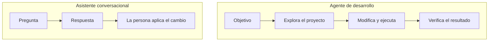
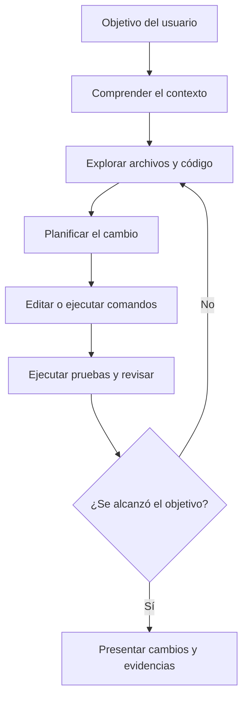
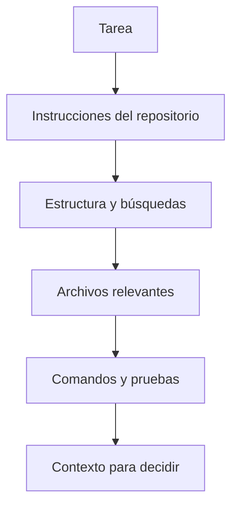
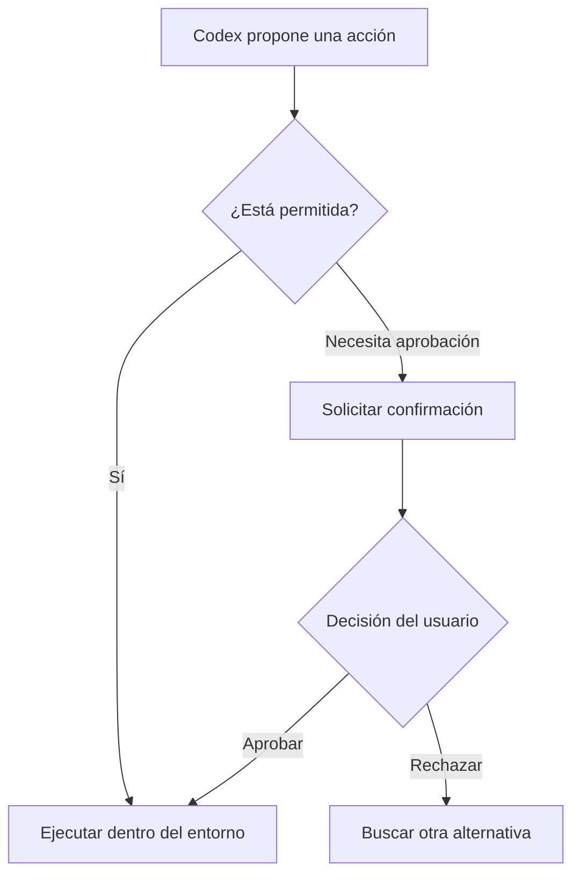
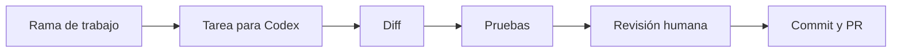
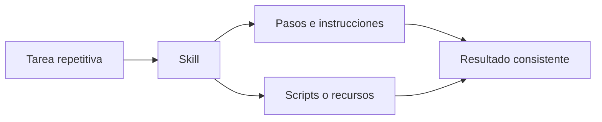

# Sesión 2 - Codex como agente de desarrollo

> Duración total: **3 horas** — 170 minutos de contenido y práctica, más 10 minutos de descanso.

## 2.0 - De conversar a delegar una tarea

> Tiempo estimado: **10 minutos**

En una conversación podemos pedir una explicación o un fragmento de código, pero seguimos trasladando manualmente la respuesta al proyecto.

Un **agente de desarrollo** puede trabajar dentro del repositorio: inspecciona archivos, busca información, modifica código, ejecuta comandos y comprueba el resultado. No recibe solamente una pregunta; recibe un **objetivo** y utiliza herramientas para tratar de alcanzarlo.



El agente no reemplaza la responsabilidad del desarrollador. Nosotros definimos el objetivo, establecemos los límites y decidimos si el resultado es correcto.

## 2.1 - El ciclo de trabajo de Codex

> Tiempo estimado: **12 minutos**

Codex combina un modelo de lenguaje con herramientas de desarrollo. El modelo interpreta la tarea y decide qué necesita hacer; las herramientas le permiten actuar sobre el entorno autorizado.



Este ciclo no siempre aparece con exactamente los mismos pasos. Una tarea pequeña puede resolverse directamente; una refactorización amplia necesitará más exploración y varias comprobaciones.

### Modelo y herramientas

- El **modelo** interpreta instrucciones, relaciona el contexto y propone las siguientes acciones.
- Las **herramientas** leen archivos, buscan texto, editan código o ejecutan comandos.
- El **entorno** limita qué carpetas, comandos y recursos puede utilizar el agente.
- El **desarrollador** supervisa el proceso y valida el resultado.

## 2.2 - Dos interfaces, el mismo proyecto

> Tiempo estimado: **10 minutos**

Utilizaremos Codex desde dos interfaces complementarias:

| Codex CLI | Aplicación de escritorio |
|---|---|
| Funciona dentro de la terminal. | Ofrece una experiencia visual. |
| Resulta natural si ya trabajamos con comandos. | Facilita seguir tareas y revisar cambios. |
| Mantiene el flujo cerca de Git, scripts y pruebas. | Integra conversación, archivos, diff y terminal. |
| Es útil para acciones rápidas y repetibles. | Es útil para tareas largas o varias líneas de trabajo. |

Cambiar de interfaz no cambia las reglas del repositorio. Ambas trabajan sobre los archivos locales y deben respetar las mismas instrucciones y permisos.

## 2.3 - Preparar Codex CLI

> Tiempo estimado: **12 minutos**

### Instalar o actualizar

Codex CLI necesita Node.js y npm. La instalación global se realiza con:

```bash
npm install -g @openai/codex
```

Para comprobar la instalación:

```bash
codex --version
```

Para actualizarlo posteriormente:

```bash
npm install -g @openai/codex@latest
```

### Abrir un proyecto

Sitúate en la raíz del repositorio antes de iniciar Codex:

```bash
cd ruta/al/proyecto
codex
```

La primera vez, Codex solicitará iniciar sesión. Una vez dentro podemos comprobar el entorno activo:

```text
/status
```

Es importante abrir Codex desde la carpeta correcta: esa ubicación ayuda a definir el proyecto y el alcance sobre el que trabajará.

## 2.4 - Trabajar desde la aplicación de escritorio

> Tiempo estimado: **10 minutos**

En la aplicación de escritorio seleccionamos una carpeta local y creamos una tarea asociada al proyecto.

El flujo básico es:

1. Abrir la aplicación e iniciar sesión.
2. Seleccionar la carpeta del repositorio.
3. Comprobar la rama y el entorno de trabajo.
4. Describir la tarea.
5. Seguir las acciones del agente.
6. Revisar los archivos modificados y el diff.
7. Ejecutar o consultar las pruebas antes de aceptar el resultado.

La interfaz visual permite seguir el trabajo con más contexto, pero no convierte automáticamente una modificación en correcta. El código y las pruebas siguen siendo la evidencia principal.

## 2.5 - Cómo obtiene contexto del proyecto

> Tiempo estimado: **14 minutos**

Codex no conoce todo el repositorio de antemano. Obtiene contexto mientras trabaja:

- Parte de nuestra solicitud y de las instrucciones disponibles.
- Examina la estructura de carpetas.
- Busca nombres, referencias y patrones.
- Lee los archivos relevantes para la tarea.
- Consulta configuración, pruebas y documentación cuando lo necesita.



Por eso una petición eficaz combina el resultado esperado con información verificable:

```text
Refactoriza el cálculo de totales sin cambiar la API pública.
No añadas dependencias.
Ejecuta las pruebas del proyecto y explica cualquier fallo.
```

No necesitamos indicar cada archivo si Codex puede descubrirlo, pero sí debemos comunicar restricciones que no pueda deducir con seguridad.

## 2.6 - Instrucciones del repositorio con `AGENTS.md`

> Tiempo estimado: **18 minutos**

`AGENTS.md` contiene instrucciones persistentes para Codex. Es una forma de dejar dentro del repositorio el conocimiento necesario para trabajar de manera consistente.

Puede incluir:

- Organización general del proyecto.
- Convenciones de código y arquitectura.
- Comandos para instalar, validar y probar.
- Archivos que no deben modificarse.
- Criterios que debe cumplir una tarea terminada.

Ejemplo breve:

```markdown
# Instrucciones del proyecto

## Código

- Utiliza JavaScript sin dependencias externas.
- No modifiques los argumentos recibidos por una función.
- Conserva las exportaciones públicas existentes.

## Verificación

- Ejecuta `npm test` después de modificar código.
- No des por terminada una tarea si las pruebas fallan.
```

En Codex CLI podemos generar un punto de partida con:

```text
/init
```

### Alcance de las instrucciones

Un `AGENTS.md` situado en la raíz establece reglas generales. También pueden existir instrucciones más específicas dentro de una subcarpeta para el código contenido en ella.

```text
proyecto/
├── AGENTS.md          ← reglas generales
├── frontend/
│   └── AGENTS.md      ← reglas específicas del frontend
└── backend/
    └── AGENTS.md      ← reglas específicas del backend
```

Las instrucciones deben ser claras y comprobables. “Escribe código de calidad” es ambiguo; “ejecuta `npm test` y no añadas dependencias” indica comportamientos concretos.

## Descanso

> Tiempo estimado: **10 minutos**

## 2.7 - Permisos, aprobaciones y seguridad

> Tiempo estimado: **14 minutos**

Un agente puede realizar acciones reales sobre el ordenador. Los permisos determinan hasta dónde puede llegar y qué acciones necesitan confirmación.

En Codex CLI podemos consultar o ajustar los permisos con:

```text
/permissions
```

La idea principal es aplicar el **mínimo permiso necesario**:

- Leer el proyecto para comprenderlo.
- Escribir únicamente dentro del espacio de trabajo autorizado.
- Solicitar confirmación cuando una acción supera esos límites.
- Mantener restringido el acceso a recursos externos cuando no sean necesarios.



Antes de aprobar un comando debemos entender su alcance, especialmente si instala software, accede a Internet, modifica archivos externos o puede eliminar información.

## 2.8 - Codex dentro del flujo de Git

> Tiempo estimado: **14 minutos**

Git permite separar el trabajo del agente, inspeccionarlo y conservar solamente los cambios correctos.

Un flujo sencillo es:



Comandos útiles para revisar el estado:

```bash
git status
git diff
git diff --stat
```

En Codex CLI también podemos solicitar una revisión con:

```text
/review
```

Una revisión de Codex ayuda a detectar problemas, pero no reemplaza las pruebas ni la decisión de la persona responsable.

### Hooks de Git

Los hooks como `pre-commit` y `pre-push` pueden ejecutar validaciones antes de registrar o enviar cambios. Son controles del repositorio y funcionan independientemente de que el código lo escriba una persona o un agente.

```text
Cambio → pre-commit → commit → pre-push → repositorio remoto
```

Codex puede ayudar a configurar o interpretar estos controles, pero no debería evitarlos para completar una tarea.

## 2.9 - Procedimientos reutilizables con skills

> Tiempo estimado: **12 minutos**

Una **skill** reúne instrucciones y recursos para un procedimiento que queremos repetir. Por ejemplo:

- Preparar una revisión de código con los criterios del equipo.
- Crear una migración siguiendo una estructura concreta.
- Ejecutar y resumir las validaciones de un proyecto.
- Generar documentación con una plantilla compartida.



`AGENTS.md` describe cómo trabajar en un repositorio. Una skill describe cómo ejecutar un procedimiento reutilizable. En esta sesión basta con reconocer la diferencia; construiremos automatizaciones más avanzadas cuando el flujo básico esté dominado.

## 2.10 - Demostración guiada

> Tiempo estimado: **14 minutos**

Disponemos de [dos proyectos alternativos](material/), con distintos niveles de complejidad:

- [`proyecto-inventario`](material/proyecto-inventario/): JavaScript sin dependencias, pocos archivos y pruebas rápidas. Permite concentrarnos en el ciclo básico de Codex.
- [`proyecto-codex-dotnet`](material/proyecto-codex-dotnet/): frontend JavaScript y backend .NET 10 con varias capas, pruebas, PostgreSQL y Aspire. Permite explorar cómo el agente trabaja sobre una solución más completa.

Podemos empezar con el inventario y utilizar Delivery Board para ampliar la demostración. En cualquiera de las dos alternativas observaremos el mismo ciclo:

1. Abrir el proyecto con Codex CLI.
2. Pedirle que explique la estructura antes de modificarla.
3. Revisar las reglas de `AGENTS.md`.
4. Solicitar un cambio concreto y acotado.
5. Observar qué archivos consulta y qué comandos ejecuta.
6. Revisar el diff generado.
7. Ejecutar las pruebas.
8. Pedir una revisión final del cambio.

Prompt de ejemplo para el inventario:

```text
Analiza este proyecto y refactoriza el módulo de inventario respetando AGENTS.md.
Conserva su API pública y su comportamiento, elimina la mutación de los datos de entrada
y ejecuta las pruebas. Al terminar, resume los cambios y las comprobaciones realizadas.
```

Después repetiremos la inspección desde la aplicación de escritorio para localizar visualmente la tarea, los archivos modificados, el diff y la evidencia de las pruebas.

Las instrucciones, requisitos y diferencias entre ambos proyectos están resumidos en [`material/README.md`](material/README.md).

## Ejercicio de la sesión

> Tiempo estimado: **30 minutos** — 20 minutos para trabajar con Codex y 10 minutos para documentar, hacer commit, push y abrir la PR.

Utiliza Codex sobre una copia de Delivery Board para refactorizar las pruebas con Moq y el patrón AAA, implementar el evolutivo de eliminación de pendientes y documentar los prompts utilizados. Durante la sesión se inicia el trabajo y se revisa el ciclo del agente; la entrega completa puede finalizarse después de la videollamada.

Las instrucciones completas se encuentran en [`ejercicio/README.md`](ejercicio/README.md).

## Ideas clave

- Codex es un agente porque puede utilizar herramientas y actuar sobre un proyecto, no solamente generar texto.
- Codex CLI y la aplicación de escritorio son dos interfaces para trabajar sobre el mismo repositorio.
- El contexto se construye a partir de la tarea, las instrucciones y los archivos relevantes.
- `AGENTS.md` convierte las convenciones del equipo en instrucciones persistentes.
- Los permisos limitan el alcance de las acciones del agente.
- Un cambio no está terminado hasta que revisamos el diff y verificamos su comportamiento.
- La responsabilidad final sobre el código continúa siendo humana.

## Documentación oficial

- [Codex CLI](https://learn.chatgpt.com/docs/codex/cli)
- [Aplicación de escritorio para Windows](https://learn.chatgpt.com/docs/windows/windows-app)
- [Instrucciones con AGENTS.md](https://learn.chatgpt.com/docs/agent-configuration/agents-md)
- [Permisos](https://learn.chatgpt.com/docs/permissions)
- [Revisión de código](https://learn.chatgpt.com/docs/code-review)
