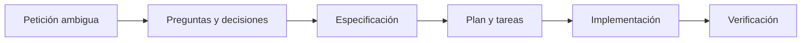
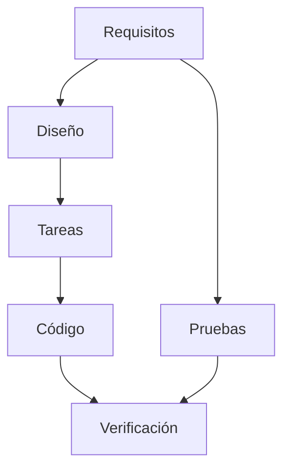
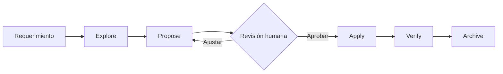

# Sesión 3 - Desarrollo guiado por especificaciones con OpenSpec

> **Duración aproximada: 3 horas, incluido un descanso de 10 minutos.**

## 3.0 - De una petición a una especificación — 10 min

En la sesión anterior utilizamos Codex para trabajar sobre un proyecto existente. Ahora daremos un paso más: antes de modificar el código, convertiremos una necesidad en una especificación revisable.

Un requerimiento como este parece sencillo:

> Queremos poder eliminar las tareas que estén en determinados estados.

Sin embargo, todavía no sabemos qué estados están permitidos, quién selecciona las tareas, qué debe ocurrir si no hay resultados ni cómo se comprobará que el cambio funciona.



## 3.1 - El coste de la ambigüedad — 10 min

Cuando faltan decisiones, el agente tiene que suponer. Puede producir código válido que no resuelva la necesidad real.

| Situación | Consecuencia posible |
|---|---|
| No se define el alcance | Se modifican componentes innecesarios |
| Faltan reglas de negocio | El comportamiento se decide durante la implementación |
| No hay criterios de aceptación | No sabemos cuándo el trabajo está terminado |
| Se cambia de idea tarde | Se repiten análisis, código y pruebas |

Una especificación no elimina la incertidumbre: la hace visible antes de empezar a programar.

## 3.2 - Qué es SDD — 10 min

**Specification-Driven Development (SDD)** es una forma de trabajar en la que una especificación versionada guía el diseño, las tareas, la implementación y la verificación.

La especificación actúa como un contrato compartido entre personas y agentes. Al aportar contexto estructurado:

- reduce suposiciones y reprocesamientos;
- aprovecha mejor la ventana de contexto y los tokens;
- permite revisar el comportamiento antes del código;
- reduce el riesgo de que el agente invente detalles;
- no sustituye la revisión humana ni garantiza que el resultado sea correcto.

## 3.3 - Qué debe describir una especificación — 20 min

No necesitamos un documento enorme. Necesitamos decisiones claras.

| Parte | Pregunta que responde |
|---|---|
| Objetivo | ¿Qué problema queremos resolver? |
| Alcance | ¿Qué entra y qué queda fuera? |
| Requisitos | ¿Qué debe poder hacer el sistema? |
| Reglas de negocio | ¿Qué comportamientos son obligatorios? |
| Diseño | ¿Qué componentes y contratos cambiarán? |
| Criterios de aceptación | ¿Cómo sabremos que funciona? |
| Tareas | ¿En qué orden se implementará? |
| Verificación | ¿Qué pruebas y controles deben pasar? |

### Historia de usuario y Gherkin

Una historia de usuario aporta intención:

```text
Como responsable del tablero
quiero eliminar las tareas pendientes
para limpiar trabajo que ya no debe realizarse.
```

Gherkin convierte ejemplos de comportamiento en criterios observables:

```gherkin
Scenario: Eliminar tareas pendientes
  Given que existen tareas con estado "Pending"
  When el usuario solicita eliminar las tareas pendientes
  Then las tareas con estado "Pending" dejan de aparecer
  And las tareas de otros estados se conservan
```

Estos criterios no son necesariamente pruebas automatizadas, pero pueden guiar su creación.

## 3.4 - Artefactos abiertos y versionables — 10 min

SDD funciona mejor cuando sus artefactos son texto que puede revisarse mediante Git:

- **Markdown:** requisitos, decisiones, diseño y tareas.
- **Mermaid:** flujos y relaciones visuales.
- **OpenAPI:** contrato HTTP de una API.
- **Gherkin:** ejemplos de comportamiento comprensibles.
- **Código y pruebas:** evidencia de la implementación.



Cuando el código, las pruebas y la especificación dejan de representar el mismo comportamiento aparece **deriva**. Por eso deben evolucionar juntos.

## 3.5 - Frameworks SDD: OpenSpec y Spec Kit — 5 min

El concepto SDD no pertenece a una herramienta concreta. Un equipo puede crear su propio flujo, pero no necesita empezar desde cero.

### OpenSpec

OpenSpec instala flujos reutilizables en el agente y mantiene las especificaciones dentro del repositorio. Su ciclo principal es sencillo:

```text
explorar → proponer → revisar → implementar → verificar → archivar
```

Lo utilizaremos porque encaja bien en un proyecto existente y permite generar la propuesta, las especificaciones, el diseño y las tareas antes de tocar el código.

### Spec Kit

Spec Kit es otra alternativa conocida. Ofrece fases como constitución del proyecto, especificación, aclaración, planificación, tareas, análisis e implementación. Es útil conocerlo, aunque en esta guía trabajaremos solamente con OpenSpec para mantener un único flujo.

## 3.6 - Instalar y preparar OpenSpec para Codex — 15 min

### Requisito

OpenSpec necesita Node.js 20.19 o superior:

```powershell
node --version
```

### Instalar la CLI

```powershell
npm install -g @fission-ai/openspec@latest
openspec --version
```

### Inicializar un proyecto

Ejecuta el comando desde la raíz de Delivery Board:

```powershell
openspec init --tools codex --no-animation
```

OpenSpec incorpora dos elementos al proyecto:

```text
proyecto/
├── .agents/skills/       # Flujos que puede invocar Codex
└── openspec/
    ├── config.yaml       # Contexto y reglas del proyecto
    ├── specs/            # Especificaciones vigentes
    └── changes/          # Cambios que están en preparación
```

Estos archivos forman parte del proyecto y deben versionarse. Después de inicializar, reinicia Codex para que detecte las skills.

### Abrir el proyecto con Codex CLI

La CLI debe iniciarse desde la raíz del proyecto que contiene `.agents/` y `openspec/`:

```powershell
cd sesiones/sesion-03/material/proyecto-codex-dotnet
codex
```

Dentro de la conversación de Codex, escribe `$` y selecciona la skill correspondiente o escribe directamente su nombre:

```text
$openspec-explore Analiza el requerimiento y ayúdame a identificar sus ambigüedades. No implementes todavía.
```

Si las skills no aparecen después de ejecutar `openspec init`, cierra la CLI, vuelve a abrirla desde la raíz del proyecto y comprueba que existe `.agents/skills/`.

### Abrir el proyecto en la aplicación visual de Codex

1. Abre en Codex la carpeta `sesiones/sesion-03/material/proyecto-codex-dotnet` como proyecto o espacio de trabajo.
2. Crea una tarea nueva dentro de esa carpeta.
3. En el cuadro de texto, escribe `$` para buscar la skill o escribe directamente `$openspec-explore`.
4. Añade el requerimiento después del nombre de la skill y envíalo.
5. Revisa desde la vista de cambios los documentos que OpenSpec cree bajo `openspec/changes/`.

```text
$openspec-explore Analiza el requerimiento y ayúdame a identificar sus ambigüedades. No implementes todavía.
```

La CLI y la aplicación visual utilizan las mismas skills del proyecto. Lo importante en ambos casos es abrir Codex con `proyecto-codex-dotnet` como carpeta de trabajo, no con una carpeta superior que deje `.agents/skills/` fuera de la raíz activa.

## Descanso — 10 min

## 3.7 - El flujo automatizado con OpenSpec y Codex — 35 min

OpenSpec no es otro modelo. Es un conjunto de instrucciones, plantillas y herramientas que guía al agente por un proceso repetible.



### 1. Explorar la necesidad

Cuando todavía hay demasiadas dudas, podemos empezar con:

```text
$openspec-explore Analiza el requerimiento de eliminar tareas que estén en determinados estados. Identifica ambigüedades y no implementes todavía.
```

La exploración ayuda a pensar, pero no crea todavía un cambio formal.

### 2. Crear la propuesta completa

```text
$openspec-propose Queremos poder eliminar las tareas que estén en determinados estados.
```

La skill analiza el repositorio y crea bajo `openspec/changes/<nombre-del-cambio>/`:

- propuesta y objetivo;
- requisitos o cambios de especificación;
- diseño técnico;
- lista ordenada de tareas.

### 3. Revisar antes de implementar

El desarrollador debe leer los artefactos, resolver las preguntas pendientes y pedir correcciones. Este es el control más importante del flujo.

```text
$openspec-update-change Revisa el cambio activo con estas decisiones: solo se eliminan tareas Pending, si no existe ninguna se devuelve un error de negocio y el frontend debe solicitar confirmación.
```

### 4. Implementar lo aprobado

Solamente después de aprobar el plan:

```text
$openspec-apply-change
```

Codex implementa las tareas y actualiza su estado. El desarrollador sigue revisando los cambios, los comandos y los resultados.

### 5. Verificar

La versión básica de OpenSpec puede validar la estructura de los artefactos:

```powershell
openspec validate --all --strict --no-interactive
```

Además, Codex debe compilar, ejecutar las pruebas y comparar el resultado con los requisitos. OpenSpec también dispone de un flujo opcional de verificación que los equipos pueden habilitar en sus perfiles.

### 6. Archivar

Cuando la implementación y las pruebas están aprobadas:

```text
$openspec-archive-change
```

El cambio se incorpora a las especificaciones vigentes y se conserva como historial.

### Resumen de uso en ambas interfaces

Los comandos se escriben en el chat de Codex, no en PowerShell:

| Momento | Codex CLI | Aplicación visual |
|---|---|---|
| Explorar | Escribir `$openspec-explore ...` en el chat | Escribir o seleccionar `$openspec-explore` en el cuadro de texto |
| Proponer | Escribir `$openspec-propose ...` | Utilizar `$openspec-propose` en la tarea abierta |
| Corregir | Escribir `$openspec-update-change ...` | Continuar la misma tarea con `$openspec-update-change` |
| Implementar | Escribir `$openspec-apply-change` | Confirmar el plan y enviar `$openspec-apply-change` |
| Archivar | Escribir `$openspec-archive-change` | Enviar `$openspec-archive-change` después de verificar |

Los comandos `openspec init`, `openspec list` y `openspec validate` sí se ejecutan en la terminal porque pertenecen a la CLI de OpenSpec.

## 3.8 - Configurar el estándar del equipo — 10 min

Las skills de OpenSpec contienen el flujo general. `openspec/config.yaml` permite añadir el contexto y las reglas estables del proyecto, por ejemplo:

- escribir los artefactos en español;
- respetar la arquitectura hexagonal;
- utilizar casos de uso explícitos;
- incluir criterios de aceptación;
- crear o actualizar pruebas unitarias;
- ejecutar build y tests antes de terminar.

Esto evita repetir las mismas instrucciones en cada solicitud. Si el equipo necesita un proceso distinto, puede personalizar los esquemas de OpenSpec o construir sus propias skills. Primero reutilizamos un estándar probado; después lo adaptamos cuando exista una necesidad real.

## Taller práctico — 40 min

El ejercicio parte del Delivery Board utilizado en la sesión anterior. Cada estudiante utilizará OpenSpec para transformar un requerimiento ambiguo en artefactos revisados y, únicamente después de aprobarlos, implementar y verificar el cambio.

Consulta las [instrucciones del ejercicio](./ejercicio/README.md).

## Cierre — 5 min

- Una petición no es todavía una especificación.
- OpenSpec automatiza el proceso, pero las decisiones siguen siendo humanas.
- Propuesta, diseño y tareas se revisan antes de implementar.
- Código, pruebas y especificaciones deben contar la misma historia.
- El flujo puede reutilizarse y adaptarse a las reglas de cada equipo.

## Recursos oficiales

- [OpenSpec](https://openspec.dev/)
- [Guía de instalación de OpenSpec](https://openspec.dev/docs/installation)
- [Inicio rápido de OpenSpec](https://openspec.dev/docs/quickstart)
- [GitHub Spec Kit](https://github.github.io/spec-kit/)
