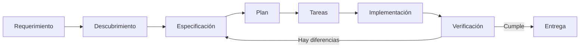
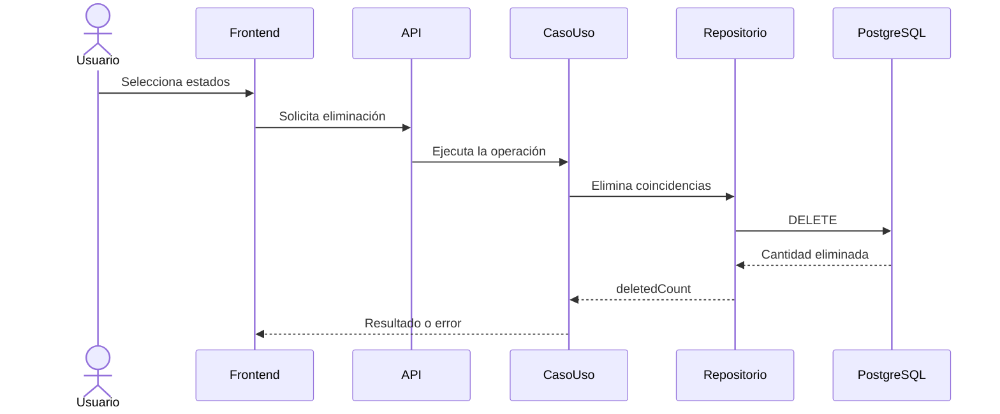
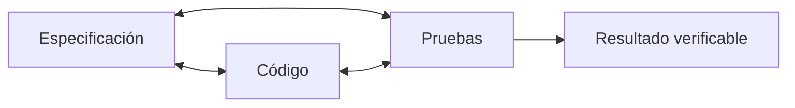

# Sesión 3 - SDD, especificaciones abiertas y ejecución agéntica

> Duración total: **3 horas** — 170 minutos de contenido y práctica, más 10 minutos de descanso.

## 3.0 - De delegar a especificar

> Tiempo estimado: **6 minutos**

Codex puede explorar un proyecto, modificarlo y ejecutar pruebas, pero no conoce las decisiones que todavía no hemos tomado. Cuando recibe un requerimiento ambiguo, necesita hacer suposiciones o detenerse para preguntar.

En esta sesión pasaremos de delegar una petición a construir una especificación que pueda guiar todo el trabajo:



## 3.1 - El coste de la ambigüedad

> Tiempo estimado: **10 minutos**

Partamos de una petición aparentemente sencilla:

> Queremos poder eliminar las tareas que estén en determinados estados.

Antes de programar necesitamos resolver preguntas como:

- ¿Qué estados pueden eliminarse?
- ¿Se selecciona uno o varios estados?
- ¿La eliminación es física o lógica?
- ¿Qué ocurre si no hay coincidencias?
- ¿Qué devuelve la API?
- ¿Debe pedirse confirmación en la interfaz?
- ¿La operación debe ser atómica?
- ¿Se conserva el endpoint anterior?

Una respuesta inventada por el agente puede producir código técnicamente correcto que resuelva el problema equivocado.

### Requerimiento, supuesto y decisión

- Un **requerimiento** expresa una necesidad.
- Una **pregunta abierta** identifica información que falta.
- Un **supuesto** permite avanzar provisionalmente, pero debe quedar visible.
- Una **decisión** resuelve una alternativa y pasa a formar parte del contrato.
- Una **restricción** marca un límite que la solución debe respetar.

## 3.2 - Qué es SDD

> Tiempo estimado: **10 minutos**

**Specification-Driven Development** es una forma de desarrollar en la que una especificación versionada guía el diseño, la planificación, la implementación y la verificación.

SDD no depende de un framework concreto. Existen herramientas que automatizan el proceso, pero un equipo también puede construir su propio estándar utilizando Markdown, contratos abiertos, diagramas, pruebas y las convenciones de su repositorio.

| Prompt aislado | Especificación viva |
|---|---|
| Vive dentro de una conversación. | Vive dentro del repositorio. |
| Puede mezclar objetivo e implementación. | Separa problema, contrato, plan y tareas. |
| Resulta difícil de reutilizar. | Puede ser leída por personas y agentes. |
| Favorece nuevas explicaciones en cada iteración. | Conserva las decisiones ya tomadas. |
| No ofrece por sí mismo trazabilidad. | Relaciona requisitos, código y pruebas. |

### Precisión y uso del contexto

Una especificación breve y estructurada puede reducir tokens desperdiciados porque evita repetir contexto, corregir supuestos y rehacer implementaciones. No garantiza que el agente nunca se equivoque, pero disminuye el espacio disponible para interpretaciones y hace más fácil detectar una desviación.

```text
Menos ambigüedad
      ↓
Menos suposiciones
      ↓
Menos reprocesamiento
      ↓
Más precisión y mejor uso del contexto
```

## 3.3 - Anatomía de una especificación útil

> Tiempo estimado: **14 minutos**

No existe una única plantilla universal. Nuestro estándar debe conservar la información necesaria para implementar y comprobar el comportamiento.

### Contexto y objetivo

- Problema actual.
- Personas o sistemas afectados.
- Valor esperado.

### Alcance y fuera de alcance

- Comportamientos incluidos.
- Capas y sistemas afectados.
- Funcionalidades que se aplazan o se excluyen.

### Definiciones

- Entidades y estados.
- Operaciones.
- Términos que podrían interpretarse de varias maneras.

### Reglas y contratos

- Reglas de negocio.
- Entradas y salidas.
- Errores esperados.
- Restricciones técnicas.

### Verificación

- Criterios de aceptación.
- Pruebas necesarias.
- Condiciones para considerar terminado el cambio.

Una buena especificación contiene suficiente precisión, pero evita explicar código que el propio repositorio ya permite descubrir.

## 3.4 - Historia de usuario y Gherkin

> Tiempo estimado: **14 minutos**

Una historia de usuario conecta la necesidad con su valor:

```text
Como responsable del tablero
quiero eliminar tareas según su estado
para limpiar el tablero sin eliminar trabajo que debe conservarse.
```

La historia no basta para implementar. Los criterios de aceptación convierten la intención en comportamientos observables.

```gherkin
Feature: Eliminación de tareas por estado

  Scenario: Eliminar tareas de un estado permitido
    Given que existen tareas pendientes y completadas
    When solicito eliminar las tareas pendientes
    Then las tareas pendientes dejan de aparecer
    And las tareas completadas se conservan
    And la respuesta indica cuántas tareas se eliminaron
```

- `Given` prepara el estado inicial.
- `When` representa la acción.
- `Then` expresa el resultado observable.
- `And` añade condiciones del mismo escenario.

También deben describirse escenarios alternativos: solicitud vacía, estado inválido, estado protegido, ausencia de coincidencias y fallo inesperado.

## 3.5 - Reglas, invariantes y errores

> Tiempo estimado: **12 minutos**

- Una **regla de negocio** indica un comportamiento obligatorio.
- Una **invariante** debe seguir siendo verdadera antes y después de la operación.
- Una **precondición** debe cumplirse para ejecutar la acción.
- Una **postcondición** debe cumplirse después de ejecutarla.

Ejemplos:

```text
Regla: solo pueden eliminarse estados autorizados.
Invariante: eliminar Pending nunca puede afectar Completed.
Precondición: debe indicarse al menos un estado.
Postcondición: deletedCount coincide con las tareas eliminadas.
```

Cada error esperado debe indicar:

- Condición que lo provoca.
- Mensaje o código estable.
- Estado HTTP.
- Representación mediante `ProblemDetails`.

## Descanso

> Tiempo estimado: **10 minutos**

## 3.6 - Especificaciones abiertas

> Tiempo estimado: **16 minutos**

### Markdown

Será el contenedor principal: se lee fácilmente, se versiona con Git y puede enlazar el resto de artefactos.

### Mermaid

Permite representar flujos y relaciones cerca del texto que los explica.



### OpenAPI

Formaliza el contrato HTTP:

- Ruta y método.
- Parámetros o cuerpo.
- Esquemas.
- Respuestas correctas.
- Errores.

La especificación debe resolver, por ejemplo, si la operación utiliza parámetros de consulta o un cuerpo con una colección de estados. La decisión debe aparecer antes que el código.

### AsyncAPI

AsyncAPI cumple una función parecida para eventos y mensajería. Delivery Board no utiliza comunicación asíncrona, por lo que lo reconoceremos sin incorporarlo artificialmente al ejercicio.

## 3.7 - La especificación como fuente de verdad

> Tiempo estimado: **10 minutos**

La especificación debe vivir dentro del proyecto y utilizar rutas predecibles:

```text
proyecto/
├── AGENTS.md
├── specs/
│   └── delete-work-items-by-status/
│       ├── README.md
│       ├── requirements.md
│       ├── acceptance.feature
│       ├── openapi.yaml
│       ├── implementation-plan.md
│       └── traceability.md
├── frontend/
└── backend/
```

Reglas de nuestro estándar:

- Las decisiones no permanecen únicamente en el chat.
- Los documentos se enlazan entre sí.
- Codex recibe la ruta exacta de la especificación.
- Una decisión nueva actualiza la fuente de verdad.
- El contrato debe evolucionar junto al comportamiento.
- El prompt activa una fase; no reemplaza la especificación.

## 3.8 - El flujo SDD con Codex

> Tiempo estimado: **14 minutos**

### 1. Descubrimiento

Codex analiza el requerimiento y el proyecto, identifica ambigüedades y propone preguntas. Todavía no implementa.

### 2. Especificación

Se documentan decisiones, historia, alcance, reglas, escenarios, contrato y flujos.

### 3. Revisión humana

La persona responsable responde preguntas, rechaza supuestos y aprueba el contrato.

### 4. Planificación

Codex convierte la especificación en cambios por capa, tareas, dependencias y verificaciones.

### 5. Implementación

El agente ejecuta tareas acotadas utilizando la especificación como referencia.

### 6. Verificación

Se comparan especificación, código, pruebas y comportamiento. Una diferencia obliga a corregir el código o actualizar conscientemente el contrato.



## 3.9 - Del diseño al plan y las tareas

> Tiempo estimado: **12 minutos**

La especificación no debería convertirse en una única tarea enorme. Un plan posible sería:

1. Aprobar requisitos y criterios.
2. Actualizar OpenAPI.
3. Ampliar el contrato de dominio.
4. Implementar persistencia.
5. Crear el caso de uso y sus pruebas.
6. Exponer el endpoint.
7. Modificar el frontend.
8. Verificar errores y escenarios.
9. Ejecutar build y tests.
10. Comparar el resultado con la especificación.

Cada tarea debe contener objetivo, alcance, dependencias, criterio de terminado y verificaciones. Esta división permite revisar el trabajo antes de que una suposición se propague por toda la solución.

## 3.10 - Trazabilidad y control de deriva

> Tiempo estimado: **12 minutos**

La trazabilidad relaciona cada decisión con una evidencia:

```text
Requisito → Criterio → Tarea → Código → Prueba
```

| Requisito | Criterio | Implementación | Prueba | Estado |
|---|---|---|---|---|
| Eliminar por estado | Escenario principal | Caso de uso | Test exitoso | Cumple |
| Conservar otros estados | Escenario principal | Repositorio | Test de filtrado | Cumple |
| Informar sin coincidencias | Escenario alternativo | Excepción | Test de error | Cumple |

Existe **deriva** cuando el código, el contrato y las pruebas dejan de representar el mismo comportamiento. La comparación no tiene que depender de una herramienta especializada: podemos crear nuestro propio control mediante revisión del diff, validación de OpenAPI, build, pruebas y una matriz de trazabilidad.

Los frameworks SDD pueden automatizar fases y controles, pero primero debemos comprender y poder adaptar el proceso manual.

## Taller práctico

> Tiempo estimado: **40 minutos** — inicio del proceso SDD durante la sesión y finalización posterior de la entrega.

El ejercicio continúa sobre Delivery Board y parte únicamente de este requerimiento:

> Queremos poder eliminar las tareas que estén en determinados estados.

No se proporciona una solución ni prompts preparados. Cada estudiante debe recorrer y documentar descubrimiento, especificación, planificación, implementación y verificación.

Las instrucciones completas se encuentran en [`ejercicio/README.md`](ejercicio/README.md).

## Ideas clave

- SDD es un concepto y un proceso, no un producto concreto.
- Cada equipo puede construir un estándar apropiado para su contexto.
- Una especificación estructurada reduce ambigüedad, repetición y reprocesamiento.
- Más detalle relevante ayuda al agente; más texto sin estructura no necesariamente.
- Historia, Gherkin, OpenAPI y Mermaid describen dimensiones diferentes del mismo cambio.
- La especificación debe evolucionar con el código.
- Los prompts activan el trabajo, pero el conocimiento estable debe permanecer en el repositorio.
- La precisión reduce alucinaciones, pero la verificación humana y automática continúa siendo necesaria.
