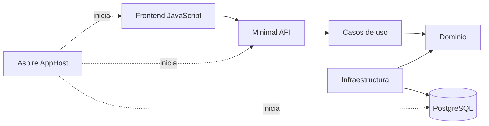

# Delivery Board

Aplicación de ejemplo para explorar cómo un agente de desarrollo trabaja sobre un proyecto existente con varias capas, persistencia, pruebas y orquestación.

El proyecto también incluye OpenSpec preparado para Codex. Sus skills están en `.agents/skills/` y la configuración del flujo SDD está en `openspec/config.yaml`. En la sesión 3 se utilizarán para generar, revisar, implementar y archivar cambios guiados por especificaciones.

## ¿Qué incluye?

- **Frontend:** HTML, CSS y JavaScript sin frameworks.
- **API:** Minimal APIs con .NET 10 y C# 14.
- **Aplicación:** casos de uso explícitos, sin MediatR.
- **Dominio:** entidad, reglas de negocio y contrato del repositorio.
- **Infraestructura:** Entity Framework Core, migraciones y PostgreSQL.
- **Pruebas:** pruebas unitarias de los casos de uso con xUnit.
- **Orquestación:** .NET Aspire levanta PostgreSQL, API y frontend.



## Requisitos

- .NET SDK 10.
- Node.js 20 o superior.
- Docker Desktop o un motor de contenedores compatible en ejecución.
- OpenSpec para el ejercicio de la sesión 3: `npm install -g @fission-ai/openspec@latest`.

## Iniciar el flujo de OpenSpec con Codex

### Codex CLI

Abre PowerShell en esta carpeta e inicia Codex:

```powershell
codex
```

Después escribe en el chat de Codex:

```text
$openspec-explore Analiza este requerimiento, identifica sus ambigüedades y no implementes todavía: <requerimiento>
```

### Aplicación visual de Codex

Abre esta carpeta como proyecto, crea una tarea nueva y escribe `$` en el cuadro de texto para localizar las skills. Selecciona `openspec-explore` o escribe directamente:

```text
$openspec-explore Analiza este requerimiento, identifica sus ambigüedades y no implementes todavía: <requerimiento>
```

Después de aclarar la necesidad, el flujo continúa en la misma conversación:

```text
$openspec-propose <requerimiento acordado>
$openspec-update-change <correcciones después de revisar los artefactos>
$openspec-apply-change
$openspec-archive-change
```

`propose` crea la especificación, el diseño y las tareas. Revisa esos documentos antes de ejecutar `apply`. Las instrucciones completas están en la [guía de la sesión 3](../../README.md).

## Ejecutar todo con Aspire

Desde la raíz de este proyecto:

```powershell
cd backend
dotnet tool restore
dotnet run --project apphost/DeliveryBoard.AppHost
```

La terminal mostrará la dirección del panel de Aspire. Desde ese panel se puede observar el frontend en ejecución, abrir su URL y consultar sus logs.

El frontend utiliza siempre la misma dirección:

```text
http://localhost:3000
```

En el panel, `frontend-installer` termina después de ejecutar `npm install`. El recurso que representa el servidor web es `frontend`: debe aparecer como **Running** y mostrar `http://localhost:3000` en la columna de direcciones.

La documentación interactiva de la API está en la ruta `/swagger` del recurso `api`.

## Compilar y ejecutar las pruebas

```powershell
cd backend
dotnet build DeliveryBoard.slnx
dotnet test DeliveryBoard.slnx
```

## Crear una migración

Las herramientas de Entity Framework están versionadas en el repositorio. Para crear otra migración:

```powershell
cd backend
dotnet tool restore
dotnet tool run dotnet-ef migrations add NombreMigracion `
  --project src/DeliveryBoard.Infrastructure `
  --startup-project src/DeliveryBoard.Api `
  --output-dir Persistence/Migrations
```

La API aplica las migraciones pendientes al arrancar.

## Endpoints

| Método | Ruta | Uso |
|---|---|---|
| `GET` | `/health` | Comprueba que la API responde. |
| `GET` | `/api/work-items/dashboard` | Devuelve las tareas y los totales del tablero. |
| `POST` | `/api/work-items` | Crea una tarea nueva. |

Ejemplo de creación:

```json
{
  "title": "Revisar integración",
  "owner": "Ana",
  "priority": "High"
}
```

Las prioridades admitidas son `Low`, `Medium` y `High`.

## Decisiones intencionadas

- No hay autenticación porque el foco está en el flujo de desarrollo.
- No hay pruebas del frontend; las pruebas se concentran en Application.
- El frontend dispone de un proxy hacia la API y la API también habilita CORS para facilitar su uso directo durante la práctica.
- La política CORS es abierta porque este proyecto se ejecuta localmente con fines formativos; no es una configuración apropiada para producción.
- Los casos de uso dependen de una interfaz de repositorio y pueden probarse sin PostgreSQL.
