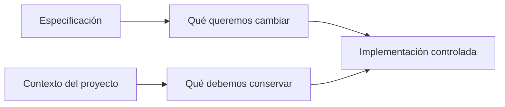
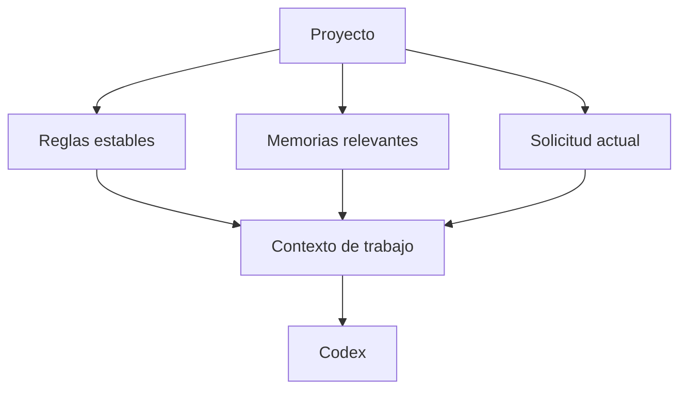
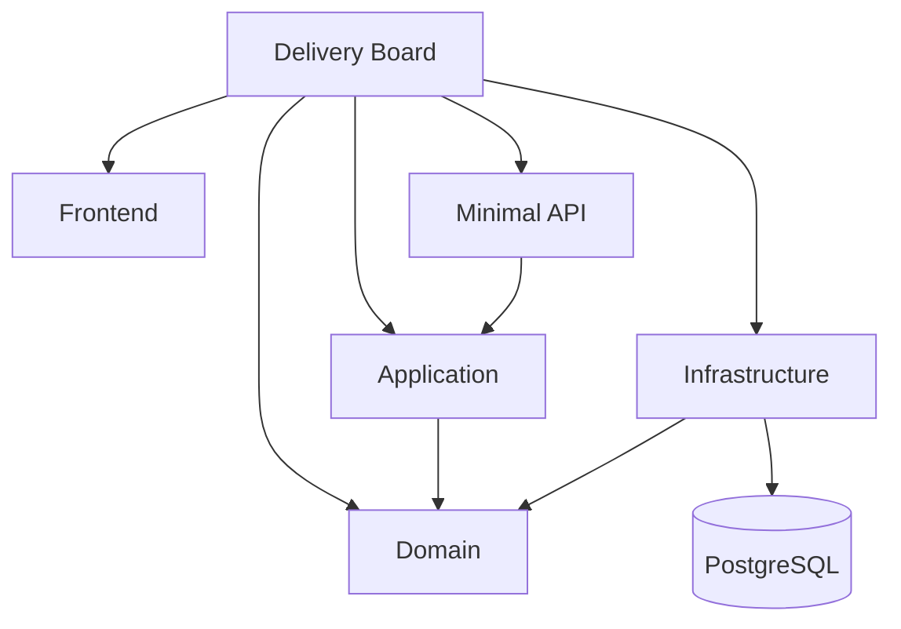
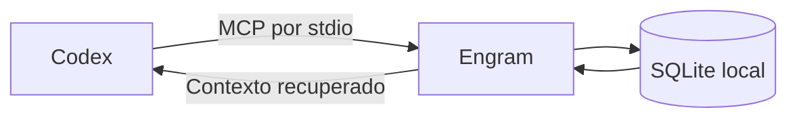
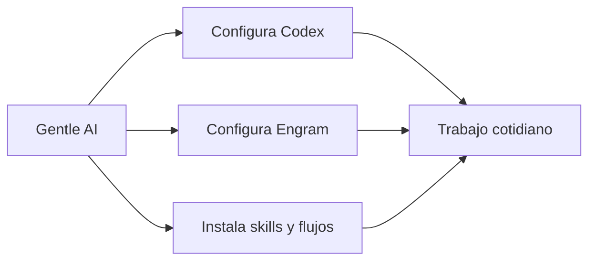
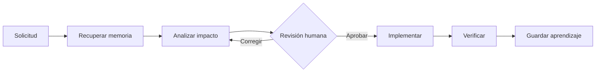

# Sesión 4 - Contexto persistente y control de entropía con Engram

> Duración total: **3 horas** — 170 minutos de contenido y práctica, más 10 minutos de descanso.

## 4.0 - De especificar un cambio a conservar el sistema

> Tiempo estimado: **5 minutos**

En la sesión anterior utilizamos una especificación para decirle al agente **qué debe cambiar**. Ahora necesitamos conservar el conocimiento que le permite entender **dónde puede cambiarlo y qué debe proteger**.



Una buena especificación no reemplaza el contexto arquitectónico. Ambos se complementan.

## 4.1 - Entropía en código asistido

> Tiempo estimado: **10 minutos**

Llamaremos **entropía** a la pérdida gradual de coherencia que aparece cuando un agente trabaja sin suficiente contexto acumulado.

| Señal | Consecuencia |
|---|---|
| Se olvidan decisiones anteriores | Se reabren discusiones ya resueltas |
| Solo se analiza una carpeta | Se omiten dependencias e impactos |
| Cada tarea usa nombres distintos | El lenguaje del proyecto se fragmenta |
| Se repite todo el historial | Se desperdicia contexto y se oculta lo importante |
| La arquitectura no está explícita | Aparecen dependencias incorrectas |

El problema no es únicamente que el agente «olvide». También puede recibir demasiada información irrelevante.

## 4.2 - Contexto de conversación, contexto del proyecto y memoria

> Tiempo estimado: **10 minutos**

- **Conversación:** información temporal de la tarea actual. Desaparece o se compacta.
- **Contexto del proyecto:** reglas, arquitectura y vocabulario versionados junto al código.
- **Memoria persistente:** decisiones y aprendizajes recuperables en futuras tareas.



La memoria no debe sustituir al repositorio: el código y las especificaciones continúan siendo la fuente de verdad del comportamiento actual.

## 4.3 - Qué debemos recordar

> Tiempo estimado: **15 minutos**

Engram aporta valor cuando guarda información curada y reutilizable.

### Conviene guardar

- decisiones arquitectónicas y su motivo;
- reglas de negocio difíciles de descubrir;
- convenciones estables del equipo;
- correcciones importantes y su causa;
- dependencias o impactos no evidentes;
- estado y próximos pasos de una tarea significativa.

### No conviene guardar

- cada comando ejecutado;
- respuestas completas del agente;
- información temporal sin utilidad futura;
- secretos, tokens o credenciales;
- afirmaciones que no se han comprobado;
- una copia completa de archivos que ya están versionados.

Una memoria útil responde, como mínimo:

```text
What: qué se decidió o descubrió
Why: por qué es importante
Where: dónde aplica
Learned: qué debemos recordar para el futuro
```

## 4.4 - Árbol de contexto y mapa de impacto

> Tiempo estimado: **15 minutos**

Un árbol de contexto resume el sistema sin copiar todo el código:



Debe incluir:

- responsabilidad de cada módulo;
- dependencias permitidas y prohibidas;
- entidades y reglas esenciales;
- flujos de negocio importantes;
- contratos de entrada y salida;
- pruebas que protegen el comportamiento.

El mapa no intenta documentar cada clase. Sirve para responder rápidamente: **si cambio esto, ¿qué más podría verse afectado?**

## Descanso

> Tiempo estimado: **10 minutos**

## 4.5 - Engram: memoria persistente mediante MCP

> Tiempo estimado: **15 minutos**

Engram es una memoria local para agentes. Codex se comunica con ella mediante MCP y Engram conserva la información en una base SQLite local.



Para Codex no es necesario mantener `engram serve` en ejecución: Codex inicia el proceso MCP cuando abre la tarea.

### Comprobar la instalación

```powershell
engram version
engram stats
```

Si `engram` no existe, instala el binario publicado para tu sistema desde los releases oficiales. También puede compilarse con Go 1.24 o superior:

```powershell
go install github.com/Gentleman-Programming/engram/cmd/engram@latest
engram version
```

El directorio de binarios de Go debe estar incluido en `PATH`. No ejecutes `engram setup codex` para este ejercicio porque esa opción configura Codex a nivel de usuario; utilizaremos el fichero local del proyecto.

### Configuración de este proyecto

La copia preparada para la sesión contiene `.codex/config.toml`:

```toml
[mcp_servers.engram]
command = "engram"
args = ["mcp", "--tools=agent", "--project=delivery-board-estudiante"]
startup_timeout_sec = 30
```

Cada estudiante debe reemplazar `delivery-board-estudiante` por un nombre que incluya su usuario de GitHub y reiniciar Codex.

### Operaciones fundamentales

| Operación | Uso |
|---|---|
| `mem_context` | Recuperar el estado reciente al empezar |
| `mem_search` | Buscar decisiones o aprendizajes anteriores |
| `mem_save` | Guardar una observación importante |
| `mem_session_summary` | Dejar un relevo al finalizar |

No es necesario memorizar la sintaxis MCP. Podemos pedirle a Codex en lenguaje natural que recupere o guarde el contexto.

## 4.6 - Qué papel cumple Gentle AI

> Tiempo estimado: **10 minutos**

**Gentle AI no traduce cada solicitud antes de enviarla al modelo.** Su función actual es configurar un ecosistema para los agentes que ya utilizamos: Engram, skills, flujos SDD, reglas y otras integraciones.



Para mantener la formación aislada, utilizamos configuración de proyecto. Gentle AI también permite previsualizar una instalación de workspace:

```powershell
gentle-ai version
```

En Windows, la versión estable actual se instala desde código fuente y necesita Go 1.25.10 o superior:

```powershell
go install github.com/gentleman-programming/gentle-ai/v2/cmd/gentle-ai@latest
gentle-ai version
```

Después podemos inspeccionar el plan de configuración sin modificar archivos:

```powershell
gentle-ai install --scope workspace --agents codex --components engram,skills --dry-run
```

El `--dry-run` permite revisar qué modificaría antes de aplicarlo. En el taller usaremos la configuración ya preparada para centrarnos en la memoria y el análisis de impacto.

## 4.7 - Recuperar contexto antes de una refactorización

> Tiempo estimado: **15 minutos**

Antes de implementar un cambio transversal:

1. Recuperar memorias relacionadas.
2. Leer las reglas y la especificación vigente.
3. Construir el mapa de componentes afectados.
4. Identificar contratos, invariantes y pruebas que deben conservarse.
5. Separar hechos comprobados de supuestos.
6. Revisar el plan antes de modificar código.
7. Guardar las nuevas decisiones cuando el trabajo termine.



Engram reduce la repetición, pero no garantiza que una memoria siga siendo correcta. Antes de usarla, debemos contrastarla con el repositorio actual.

## Taller práctico

> Tiempo estimado: **70 minutos**

El taller continúa con Delivery Board. Cada estudiante construirá un mapa de contexto, guardará decisiones relevantes en Engram, abrirá una tarea nueva para comprobar la recuperación y guiará una refactorización transversal sin romper la arquitectura.

Consulta las [instrucciones del ejercicio](./ejercicio/README.md).

## Cierre

> Tiempo estimado: **5 minutos**

- Una conversación larga no equivale a memoria útil.
- El repositorio conserva los hechos actuales; Engram conserva decisiones y aprendizajes.
- El contexto debe ser pequeño, relevante y comprobable.
- Gentle AI configura el ecosistema; Engram aporta la memoria persistente.
- Antes de refactorizar debemos conocer dependencias, contratos e invariantes.

## Recursos oficiales

- [Engram](https://github.com/Gentleman-Programming/engram)
- [Configuración de agentes con Engram](https://github.com/Gentleman-Programming/engram/blob/main/docs/AGENT-SETUP.md)
- [Gentle AI](https://github.com/Gentleman-Programming/gentle-ai)
- [Uso previsto de Gentle AI](https://github.com/Gentleman-Programming/gentle-ai/blob/main/docs/intended-usage.md)
