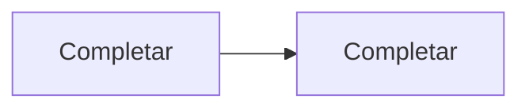

# Contexto de Delivery Board

## Propósito

Describe en pocas líneas el problema que resuelve el sistema.

## Módulos y responsabilidades

| Módulo | Responsabilidad | Puede depender de |
|---|---|---|
| Frontend | Completar durante el ejercicio | Completar |
| Api | Completar durante el ejercicio | Completar |
| Application | Completar durante el ejercicio | Completar |
| Domain | Completar durante el ejercicio | Completar |
| Infrastructure | Completar durante el ejercicio | Completar |

## Dependencias prohibidas

- Completar durante el ejercicio.

## Entidades, estados e invariantes

- Completar durante el ejercicio.

## Flujo principal

## Contratos relevantes

- Completar durante el ejercicio.

## Pruebas y validaciones

- Completar durante el ejercicio.

## Riesgos conocidos

- Completar durante el ejercicio.
