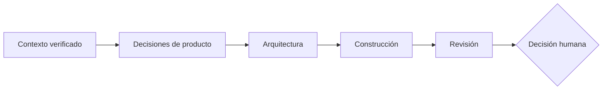
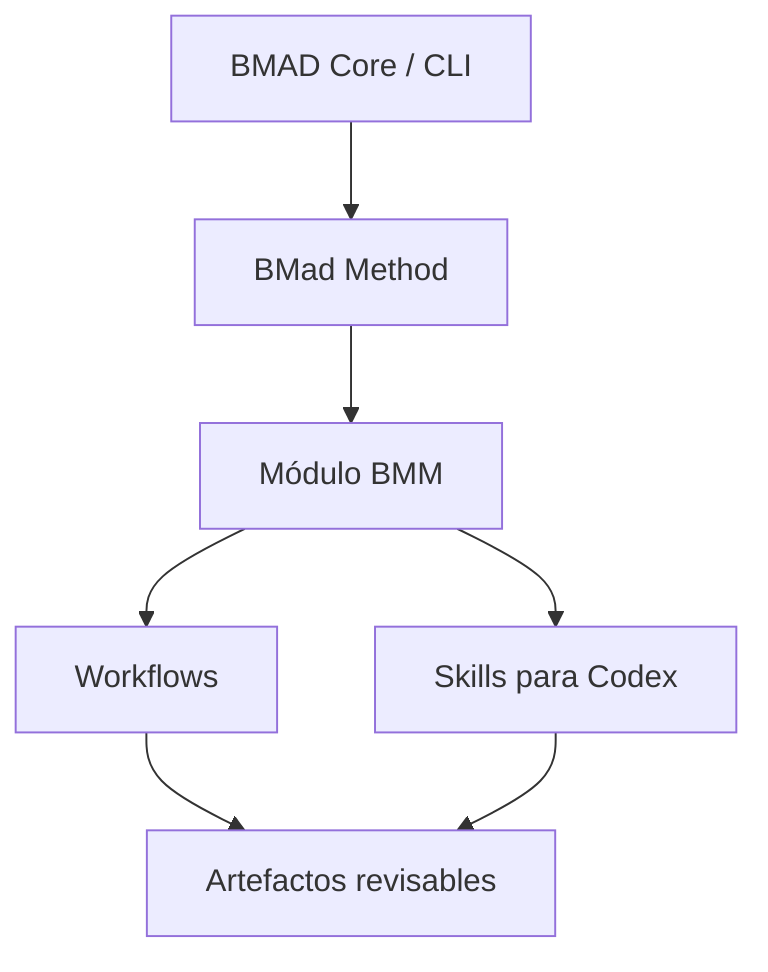
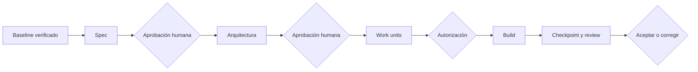

# Sesión 5 - Automatización del ciclo de software con BMad Method

> Duración total: **3 horas** — 170 minutos de contenido y práctica, más 10 minutos de descanso.

## Objetivos de la sesión

Al finalizar, cada participante podrá:

- explicar por qué repartir responsabilidades reduce los riesgos de un agente único;
- distinguir **BMad Method**, el módulo **BMM** y el framework/CLI **BMAD Core**;
- instalar BMad Method de forma reproducible para Codex;
- coordinar análisis, arquitectura, construcción y revisión mediante artefactos y *handoffs*;
- descomponer un cambio en unidades de trabajo pequeñas, verificables y reversibles;
- conservar gates humanos antes de modificar código y antes de aceptar el resultado;
- utilizar el flujo oficial para cambios pequeños sin convertir cada ticket en un proceso innecesariamente pesado.

## Agenda

| Bloque                                              | Tiempo |
| --------------------------------------------------- | -----: |
| 5.0 - De conservar contexto a repartir trabajo      |  5 min |
| 5.1 - El límite del agente único                    | 10 min |
| 5.2 - Modelo mental de BMad Method                  | 15 min |
| 5.3 - Responsabilidades, autoridad y *handoffs*     | 15 min |
| 5.4 - Requisitos, microtareas y unidades de trabajo | 10 min |
| Descanso                                            | 10 min |
| 5.5 - Instalación reproducible para Codex           | 15 min |
| 5.6 - Flujo oficial y recorrido pedagógico          | 15 min |
| 5.7 - Artefactos, checkpoints y evidencia           | 10 min |
| Taller práctico                                     | 70 min |
| Cierre                                              |  5 min |

Los bloques de contenido y práctica suman **170 minutos**. El descanso completa las **3 horas**.

## 5.0 - De conservar contexto a repartir trabajo

> Tiempo estimado: **5 minutos**

En la sesión anterior aprendimos a conservar decisiones, recuperar memoria y analizar el impacto antes de refactorizar. Ese contexto permite que un agente comprenda mejor el sistema, pero no resuelve por sí solo otro problema: una tarea puede mezclar decisiones de producto, arquitectura, implementación y validación.



La meta de esta sesión no es añadir más texto al prompt. Es organizar el trabajo para que cada responsabilidad reciba una entrada clara, produzca un artefacto revisable y entregue el resultado a la siguiente etapa sin perder la intención original.

## 5.1 - El límite del agente único

> Tiempo estimado: **10 minutos**

Un agente puede analizar, diseñar, programar y revisar. El problema aparece cuando todas esas responsabilidades se mezclan sin límites:

| Señal                                            | Riesgo                                          |
| ------------------------------------------------ | ----------------------------------------------- |
| Decide requisitos mientras programa              | La implementación fija reglas que nadie aprobó  |
| Diseña y revisa su propia solución sin contraste | Confirma sus propios supuestos                  |
| Recibe todo el historial en cada paso            | Aumentan el ruido y la compactación             |
| Cambia el alcance para resolver un bloqueo       | El código deja de corresponder al ticket        |
| Declara que “QA pasó” sin evidencia              | Se confunde una afirmación con una verificación |

Distribuir responsabilidades ayuda a separar preguntas distintas:

- **Producto:** ¿qué problema resolvemos y qué comportamiento aceptamos?
- **Arquitectura:** ¿dónde debe vivir el cambio y qué contratos debe conservar?
- **Construcción:** ¿qué unidad de trabajo se implementa ahora?
- **Verificación:** ¿qué evidencia demuestra que el candidato cumple lo acordado?

Los nombres de los roles no prueban que existan procesos aislados, ejecución paralela ni autonomía. La evidencia está en los artefactos, los límites de autoridad, los *handoffs* y las verificaciones realizadas.

## 5.2 - Modelo mental de BMad Method

> Tiempo estimado: **15 minutos**

**BMad Method** es un método ágil asistido por IA que organiza el trabajo mediante agentes, workflows y artefactos especializados. En esta formación utilizaremos el módulo **BMM**, orientado al ciclo de desarrollo de software.

**BMAD Core** continúa siendo el framework y la CLI subyacentes. No utilizaremos “BMAD Core” como nombre del método completo: diferenciaremos el motor de la metodología que ejecutamos sobre él.



### Skills que utilizaremos

| Skill                      | Uso en esta sesión                                                              |
| -------------------------- | ------------------------------------------------------------------------------- |
| `$bmad-help`               | Identificar el siguiente paso disponible sin memorizar todo el método           |
| `$bmad-project-context`    | Preparar o contrastar el contexto estable del proyecto                          |
| `$bmad-spec`               | Aclarar el comportamiento de un cambio cuando todavía existen decisiones reales |
| `$bmad-architecture`       | Hacer explícitos límites, contratos e impactos cuando el cambio lo necesita     |
| `$bmad-build`              | Recorrer el flujo oficial de construcción de un cambio pequeño                  |
| `$bmad-checkpoint-preview` | Inspeccionar qué contiene el candidato antes de aceptarlo                       |
| `$bmad-code-review`        | Revisar el cambio con foco en defectos y criterios acordados                    |

No es necesario invocar todas las skills para todos los tickets. Un método útil reduce la ceremonia cuando el cambio es pequeño y añade estructura únicamente donde evita ambigüedad o riesgo.

## 5.3 - Responsabilidades, autoridad y *handoffs*

> Tiempo estimado: **15 minutos**

BMM distribuye responsabilidades de análisis, arquitectura y desarrollo. En su configuración base no existe un agente QA separado. En esta sesión trataremos **QA como una responsabilidad de verificación** ejercida mediante el desarrollador, los checkpoints y la revisión de código.

El módulo externo **Test Architect/TEA** amplía capacidades de testing, pero queda **fuera de alcance**. No se instalará ni se utilizará en esta sesión.

| Responsabilidad      | Puede decidir                                                 | No puede decidir por sí sola               | Entrega esperada              |
| -------------------- | ------------------------------------------------------------- | ------------------------------------------ | ----------------------------- |
| Análisis de producto | problema, actores, reglas y criterios propuestos              | cambios técnicos o alcance no confirmado   | especificación revisable      |
| Arquitectura         | componentes, contratos, dependencias y orden técnico          | nuevas reglas de negocio                   | diseño y límites explícitos   |
| Desarrollo           | implementación de unidades aprobadas y pruebas asociadas      | ampliar el alcance o reescribir requisitos | candidato y evidencia técnica |
| Verificación/QA      | contrastar criterios, ejecutar pruebas y reportar defectos    | aprobar negocio o corregir silenciosamente | informe y decisión pendiente  |
| Persona responsable  | aprobar, rechazar, corregir el alcance y aceptar el resultado | delegar su responsabilidad final           | gates registrados             |

### Contrato de handoff

Cada *handoff* debe responder:

1. ¿Qué artefacto constituye la entrada?
2. ¿Qué decisiones ya están aprobadas?
3. ¿Qué preguntas continúan abiertas?
4. ¿Qué puede modificar la siguiente responsabilidad?
5. ¿Qué evidencia debe devolver?

No se debe copiar la conversación completa entre etapas. Se entregan artefactos y referencias pequeñas que permitan verificar la intención sin reconstruir todo el historial.

## 5.4 - Requisitos, microtareas y unidades de trabajo

> Tiempo estimado: **10 minutos**

Una lista de archivos no es un plan. Una **unidad de trabajo** entrega un comportamiento verificable y puede revisarse o revertirse sin arrastrar cambios no relacionados.

| Campo        | Pregunta                                                      |
| ------------ | ------------------------------------------------------------- |
| Resultado    | ¿Qué comportamiento quedará disponible?                       |
| Entrada      | ¿Qué requisito o artefacto lo autoriza?                       |
| Dependencia  | ¿Qué debe existir antes?                                      |
| Alcance      | ¿Qué puede cambiar y qué queda fuera?                         |
| Verificación | ¿Qué prueba enfocada y qué escenario funcional lo demuestran? |
| Rollback     | ¿Qué archivos o comportamiento pueden retirarse juntos?       |

Para el taller utilizaremos tres unidades secuenciales:

1. reglas de transición en el dominio con sus pruebas;
2. operación persistida y contrato HTTP con pruebas de aplicación;
3. interacción del tablero y comprobación funcional.

Las pruebas pertenecen a la misma unidad que el comportamiento. No crearemos un commit de “modelos”, otro de “servicios” y otro de “tests” si ninguno entrega por sí solo una capacidad revisable.

## Descanso

> Tiempo estimado: **10 minutos**

## 5.5 - Instalación reproducible para Codex

> Tiempo estimado: **15 minutos**

### Requisitos

- Node.js **20.12 o superior**.
- [`uv`](https://docs.astral.sh/uv/) disponible en `PATH`.
- Git.
- Un cliente Codex que cargue las skills de proyecto desde `.agents/skills`, como Codex CLI o la aplicación de escritorio.

La README etiquetada de BMad Method v6.11.0 enumera Python 3.10+ y `uv`. La guía de instalación actual aclara que, cuando `uv` está disponible, este puede provisionar el intérprete que necesitan las skills. Para mantener un entorno homogéneo durante el aula recomendamos Python **3.11 o superior**, pero su ausencia o una versión anterior no bloquean la instalación.

Comprobar las herramientas:

```powershell
node --version
uv --version
git --version
# Diagnóstico opcional del entorno recomendado:
python3 --version  # o: python --version
```

El material canónico **no incluye** `_bmad/`, `_bmad-output/` ni las skills generadas por BMad. La instalación forma parte del taller para que el estudiante observe qué se incorpora y pueda reproducirlo con una versión fijada.

Desde la raíz de la copia personal de Delivery Board:

```powershell
npx --yes bmad-method@6.11.0 install --directory . --modules bmm --tools codex --yes
```

Después, comprobar el estado real:

```powershell
npx --yes bmad-method@6.11.0 status
```

No existe un comando `bmad validate`. La validación de esta sesión combina el comando oficial `status` con OpenSpec, compilación, pruebas y comprobaciones separadas para cambios rastreados, preparados y archivos textuales no rastreados.

El proyecto incluye `scripts/install-bmad.ps1` como envoltorio reproducible del comando anterior. Debe ejecutarse únicamente en la copia personal, nunca para vendorizar BMad dentro del material del instructor.

El target `--tools codex` prepara las skills en `.agents/skills`; no instala ni valida el cliente Codex. El cliente se abre después desde la carpeta del proyecto para comprobar que reconoce `$bmad-help`.

## 5.6 - Flujo oficial y recorrido pedagógico

> Tiempo estimado: **15 minutos**

### Happy path para un cambio pequeño

El flujo oficial recomendado para un ticket pequeño comienza con:

```text
$bmad-build
```

`$bmad-help` permite consultar el siguiente paso cuando exista una duda. No necesitamos desplegar todo el método para una modificación acotada.

### Recorrido pedagógico de esta sesión

El ticket del taller contiene decisiones de negocio y atraviesa varias capas. Por eso haremos explícitas dos etapas antes de construir:

```text
$bmad-project-context
$bmad-spec
$bmad-architecture
$bmad-build
```

- `$bmad-spec` se utiliza porque debemos acordar transiciones, errores y comportamiento observable.
- `$bmad-architecture` se utiliza porque el cambio afecta dominio, aplicación, persistencia, API y frontend.
- Si un cambio futuro ya tiene esos elementos claros, se debe preferir el flujo directo de `$bmad-build`.

### Gates humanos



No se implementa mientras el comportamiento o el diseño sigan pendientes de aprobación. Tampoco se modifica la especificación durante el build para acomodarla al código.

## 5.7 - Artefactos, checkpoints y evidencia

> Tiempo estimado: **10 minutos**

Después de ejecutar un workflow, debemos inspeccionar los artefactos realmente generados por la versión instalada. No se da por terminada una etapa porque el agente lo afirme.

```text
$bmad-checkpoint-preview
$bmad-code-review
```

La revisión se completa con comandos técnicos:

```powershell
./scripts/validate-session-05.ps1
```

La evidencia mínima incluye:

- versión y estado de BMad Method;
- especificación y arquitectura aprobadas cuando sean aplicables;
- unidades de trabajo y sus dependencias;
- diff del candidato;
- pruebas enfocadas y suite completa;
- escenario funcional con Aspire;
- defectos encontrados y decisión humana.

`$bmad-build` v6.11.0 ya incorpora una corrección acotada: autoaplica hallazgos triviales clasificados como `patch`, vuelve a planificación ante `bad_spec` hasta un máximo de cinco iteraciones y devuelve `intent_gap` a la persona responsable. En esta sesión inspeccionamos ese comportamiento y conservamos sus gates humanos. La sesión 6 diseñará pipelines *unattended*, inyección de fallos y mecanismos de autocorrección personalizados.

## Taller práctico

> Tiempo estimado: **70 minutos**

El taller continúa sobre Delivery Board. El tablero ya conoce los estados `Pending`, `InProgress` y `Completed`, pero no permite que una tarea avance entre ellos.

### Ticket

> Queremos que una tarea pueda avanzar desde `Pending` a `InProgress` y después a `Completed` directamente desde el tablero.

Como mínimo se deben conservar estas reglas:

- solo se permiten `Pending → InProgress → Completed`;
- `Completed` es terminal;
- el dominio gobierna la transición;
- el contrato HTTP y sus errores se definen antes de programar;
- existen pruebas para transiciones válidas, estado terminal y tarea inexistente;
- la interfaz actualiza tareas y contadores después de la operación;
- no se incorporan MediatR, AutoMapper, autenticación ni dependencias innecesarias.

El ejercicio completo está en [`ejercicio/README.md`](ejercicio/README.md).

## Cierre

> Tiempo estimado: **5 minutos**

- BMad Method organiza el trabajo; BMAD Core aporta el framework y la CLI.
- Un rol es una responsabilidad, no una prueba de aislamiento, paralelismo o autonomía.
- Para cambios pequeños se prefiere `$bmad-build`; se añaden spec y arquitectura cuando evitan decisiones implícitas.
- Los *handoffs* transportan artefactos y autoridad, no conversaciones completas.
- BMM base no incorpora un agente QA separado; la verificación se realiza con desarrollo, checkpoints y revisión.
- Ningún workflow sustituye los gates humanos ni la evidencia técnica.
- `$bmad-build` contiene auto-fix y loopbacks acotados; los pipelines *unattended* y la autocorrección personalizada pertenecen a la sesión 6.

## Recursos oficiales

- [BMad Method v6.11.0](https://github.com/bmad-code-org/BMAD-METHOD/releases/tag/v6.11.0)
- [Instalar BMad Method](https://docs.bmad-method.org/start/install-bmad/)
- [Mapa de workflows](https://docs.bmad-method.org/reference/workflow-map/)
- [Agentes y responsabilidades](https://docs.bmad-method.org/reference/agents/)
- [Construir un cambio](https://docs.bmad-method.org/build/build-a-change/)
- [Crear e inspeccionar un checkpoint](https://docs.bmad-method.org/build/checkpoint-a-change/)
