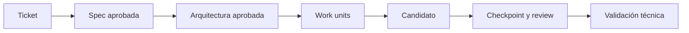

# Ejercicio práctico - Evolucionar Delivery Board con BMad Method

## Objetivo

Instalar BMad Method v6.11.0 en una copia personal de Delivery Board y coordinar especificación, arquitectura, construcción y verificación para implementar un cambio de estado trazable, sin ampliar el alcance y observando la corrección acotada que incorpora `$bmad-build`.

## Resultado esperado

Al terminar debe existir un ciclo reconstruible desde el ticket hasta la evidencia:



## 1. Preparar el fork y la rama

Actualiza `main` desde el repositorio central y crea una rama de trabajo:

```powershell
git fetch upstream
git switch main
git merge --ff-only upstream/main
git switch -c <github-login>/sesion-05-bmad
```

Si `--ff-only` falla, detente y revisa por qué tu `main` contiene cambios propios. No fuerces la actualización.

Crea la carpeta de entrega:

```text
estudiantes/<github-login>/sesion-05/ejercicio-01/
```

## 2. Copiar el proyecto canónico

Copia únicamente:

```text
sesiones/sesion-05/material/proyecto-codex-dotnet/
```

dentro de:

```text
estudiantes/<github-login>/sesion-05/ejercicio-01/proyecto/
```

No copies `bin/`, `obj/`, `node_modules/`, bases SQLite de Engram, credenciales, logs ni resultados temporales.

El material no contiene `_bmad/`, `_bmad-output/` ni las skills BMad generadas. Las crearás de forma reproducible en tu copia durante el ejercicio.

## 3. Verificar el baseline

Desde la raíz de `proyecto/`, ejecuta el modo previo a la instalación:

```powershell
./scripts/validate-session-05.ps1 -Baseline
```

Este control valida OpenSpec, compila el backend, ejecuta las pruebas y comprueba cambios rastreados, preparados y archivos textuales no rastreados sin exigir todavía una instalación BMad.

No continúes si el baseline falla. Registra en `README.md` las versiones y el resultado inicial.

## 4. Configurar Engram y recuperar contexto

En `proyecto/.codex/config.toml`, reemplaza:

```text
delivery-board-estudiante
```

por:

```text
delivery-board-<github-login>
```

Reinicia Codex desde `proyecto/`. Recupera el contexto reciente y contrástalo con:

- `AGENTS.md`;
- `context/PROJECT_CONTEXT.md`;
- `context/BASELINE.md`;
- el código actual.

No aceptes una memoria como fuente de verdad sin comprobarla. No guardes tokens, claves API, rutas privadas ni respuestas completas.

## 5. Instalar BMad Method v6.11.0

Comprueba los requisitos:

```powershell
node --version
uv --version
git --version
# Diagnóstico opcional del entorno recomendado:
python3 --version  # o: python --version
```

El instalador requiere Node.js 20.12 o superior y las skills de construcción requieren `uv`. La README etiquetada v6.11.0 también enumera Python 3.10+; la guía actual aclara que `uv` puede provisionarlo. Para el aula recomendamos Python 3.11 o superior, pero el script solo advertirá si no está disponible o es anterior. Git es necesario para el ejercicio. Para ejecutarlo se necesita un cliente Codex que cargue `.agents/skills`; el target `--tools codex` prepara esa carpeta sin exigir que Codex CLI esté en `PATH`.

Desde `proyecto/`, ejecuta:

```powershell
./scripts/install-bmad.ps1
```

El script utiliza exactamente:

```powershell
npx --yes bmad-method@6.11.0 install --directory . --modules bmm --tools codex --yes
```

Comprueba el estado:

```powershell
npx --yes bmad-method@6.11.0 status
```

Reinicia Codex después de la instalación para que detecte las skills nuevas. Escribe `$bmad-help` y comprueba que están disponibles:

- `$bmad-help`;
- `$bmad-project-context`;
- `$bmad-spec`;
- `$bmad-architecture`;
- `$bmad-build`;
- `$bmad-checkpoint-preview`;
- `$bmad-code-review`.

No existe `bmad validate`. No utilices ni documentes ese comando.

## 6. Preparar el contexto del proyecto

Invoca:

```text
$bmad-project-context
```

Contrasta cualquier artefacto generado con el contexto ya verificado. Si existe una diferencia:

1. comprueba el código;
2. identifica qué fuente estaba desactualizada;
3. corrige el artefacto apropiado antes de continuar;
4. registra la decisión en `ORCHESTRATION_LOG.md`.

No dupliques todo `PROJECT_CONTEXT.md` dentro de cada prompt. Entrega referencias y decisiones relevantes.

## 7. Ticket original

Entrega al workflow únicamente este ticket inicial:

> Queremos que una tarea pueda avanzar desde `Pending` a `InProgress` y después a `Completed` directamente desde el tablero.

Todavía no implementes. El resultado aprobado debe conservar estas reglas:

- solo se permiten `Pending → InProgress → Completed`;
- `Completed` es terminal;
- el dominio gobierna la transición;
- el método, la ruta, la entrada, las respuestas y los errores HTTP se definen antes de programar;
- existen pruebas para las transiciones válidas, el estado terminal y una tarea inexistente;
- la interfaz actualiza la tarea y los contadores después de la operación;
- no se incorporan MediatR, AutoMapper, autenticación ni dependencias innecesarias.

Todavía deben hacerse explícitas decisiones como el control mostrado en la interfaz, el comportamiento durante la petición, los mensajes y el contrato exacto del endpoint.

## 8. Crear y revisar la especificación

Utiliza `$bmad-spec` porque todavía existen decisiones de comportamiento reales:

```text
$bmad-spec
```

Revisa el artefacto y confirma que incluye:

- problema y resultado de producto;
- alcance y elementos fuera de alcance;
- transición permitida en cada estado;
- comportamiento de `Completed`;
- tarea inexistente y errores observables;
- interacción del frontend durante éxito y error;
- criterios de aceptación para los casos principales.

### Gate humano 1

No continúes hasta aprobar personalmente la especificación. Registra en `ORCHESTRATION_LOG.md`:

- artefacto revisado;
- corrección solicitada, si existió;
- decisión final;
- motivo de la aprobación.

## 9. Hacer explícita la arquitectura

Este ticket atraviesa dominio, aplicación, persistencia, API y frontend. Por eso `$bmad-architecture` aporta una decisión real y debe utilizarse:

```text
$bmad-architecture
```

La arquitectura debe indicar:

- método de dominio responsable de la transición;
- operación necesaria en `IWorkItemRepository`;
- caso de uso y contrato de Application;
- endpoint y `ProblemDetails` esperados;
- persistencia con Entity Framework Core;
- cambio mínimo en el frontend;
- pruebas por unidad de trabajo;
- componentes que no necesitan modificarse.

### Gate humano 2

Comprueba que Domain no adquiere dependencias, que Application depende solo de Domain y que Infrastructure continúa implementando contratos del dominio. No autorices construcción mientras existan reglas de negocio implícitas o cambios sin motivo.

## 10. Descomponer el cambio en work units

El plan debe contener tres unidades de comportamiento, no grupos por tipo de archivo:

| Unidad | Resultado | Verificación mínima |
|---|---|---|
| 1. Transición de dominio | La entidad avanza únicamente por estados permitidos | Pruebas de avance y estado terminal |
| 2. Operación persistida | El contrato HTTP ejecuta y guarda la transición | Pruebas del caso de uso, tarea inexistente y contrato revisado |
| 3. Interacción del tablero | La persona avanza una tarea y observa contadores actualizados | Escenario funcional desde el navegador |

Para cada unidad registra:

- entrada aprobada;
- dependencia;
- alcance y fuera de alcance;
- prueba enfocada y resultado esperado;
- escenario runtime o motivo de `N/A`;
- rollback boundary.

Las pruebas se implementan con el comportamiento que verifican. No dejes todas las pruebas para una unidad posterior.

### Gate humano 3

Aprueba el orden y los límites antes de ejecutar el build.

## 11. Construir el cambio

Para cambios pequeños, el happy path oficial es:

```text
$bmad-build
```

En esta sesión ya hicimos spec y arquitectura porque el ticket contenía decisiones y un impacto transversal. No conviertas esa secuencia en una obligación para tickets futuros que ya estén suficientemente definidos.

Durante la construcción:

- implementa únicamente las unidades aprobadas;
- conserva los contratos y reglas existentes;
- no cambies la especificación para acomodarla al código;
- revisa el diff al completar cada unidad;
- registra la prueba enfocada y el resultado exacto;
- registra los `patch` autoaplicados y cualquier loopback realizado por el workflow.

`$bmad-build` v6.11.0 autoaplica hallazgos triviales clasificados como `patch`. Un `bad_spec` vuelve a planificación y revisión, con un máximo de cinco iteraciones; un `intent_gap` vuelve a la persona responsable. Si aparece una decisión nueva o se alcanza ese gate, detén el build y resuélvelo humanamente antes de continuar.

## 12. Inspeccionar el checkpoint y revisar el código

Invoca:

```text
$bmad-checkpoint-preview
```

Comprueba qué archivos y artefactos forman el candidato. Después ejecuta:

```text
$bmad-code-review
```

BMM base no incluye un agente QA separado. En este ejercicio, QA es una responsabilidad de verificación ejercida mediante el desarrollador, el checkpoint, la revisión y las comprobaciones técnicas.

El módulo externo Test Architect/TEA está fuera de alcance y no debe instalarse.

### Gate humano 4

Si la revisión encuentra un defecto o informa una corrección automática:

1. registra el hallazgo, su clasificación y la evidencia;
2. inspecciona cualquier `patch` autoaplicado;
3. decide si el resultado bloquea la aceptación;
4. autoriza explícitamente cualquier corrección que requiera una decisión;
5. vuelve a ejecutar las verificaciones afectadas.

No añadas un orquestador externo ni personalices un pipeline *unattended*. La sesión 6 utilizará inyección de fallos para diseñar mecanismos de autocorrección propios; esta sesión se limita al comportamiento acotado que ya ofrece `$bmad-build` y a sus gates humanos.

## 13. Validar técnicamente

Desde `proyecto/`:

```powershell
./scripts/validate-session-05.ps1
```

El script comprueba el estado de BMad Method y ejecuta las validaciones reales del proyecto. También puedes revisar cada parte:

```powershell
npx --yes bmad-method@6.11.0 status
openspec validate --all --strict --no-interactive
openspec validate --archived --strict --no-interactive
cd backend
dotnet build DeliveryBoard.slnx
dotnet test DeliveryBoard.slnx --no-build
```

Revisa además el alcance y ejecuta el script desde la raíz del proyecto para cubrir cambios rastreados, preparados y archivos textuales no rastreados:

```powershell
git status --short
./scripts/validate-session-05.ps1
```

## 14. Comprobar el comportamiento con Aspire

Desde `proyecto/backend`:

```powershell
dotnet tool restore
dotnet run --project apphost/DeliveryBoard.AppHost
```

En el navegador:

1. crea una tarea y confirma que comienza en `Pending`;
2. avánzala a `InProgress`;
3. comprueba la tarea y los contadores;
4. avánzala a `Completed`;
5. comprueba de nuevo la tarea y los contadores;
6. intenta avanzar una tarea completada y verifica el error definido;
7. comprueba el comportamiento acordado para una tarea inexistente.

Detén Aspire al terminar. Registra el escenario y su resultado, no una afirmación genérica como “funciona”.

## 15. Documentar la evidencia

### `README.md`

Incluye:

- usuario, entorno y versiones;
- resultado del baseline;
- resumen del ticket y decisiones aprobadas;
- por qué spec y arquitectura aportaban valor en este cambio;
- roles o responsabilidades realmente ejercidos;
- diferencia entre un nombre de rol y una ejecución comprobable;
- build, tests, validación y escenario Aspire;
- conclusión sobre el valor y el coste de los *handoffs*.

### `PROMPTS.md`

Conserva:

- invocaciones iniciales de las skills utilizadas;
- preguntas y correcciones relevantes;
- autorizaciones humanas;
- indicaciones de seguimiento necesarias.

No copies respuestas completas, trazas extensas, secretos ni variables de entorno.

### `ORCHESTRATION_LOG.md`

Utiliza una tabla con:

| Orden | Responsabilidad | Entrada | Salida/artefacto | Gate humano | Evidencia |
|---:|---|---|---|---|---|
| 1 | Producto | Ticket | Completar | Completar | Completar |

Añade las unidades de trabajo, sus verificaciones, rollback boundaries, defectos encontrados y decisiones de aceptación.

## Estructura esperada

```text
ejercicio-01/
├── README.md
├── PROMPTS.md
├── ORCHESTRATION_LOG.md
└── proyecto/
    ├── AGENTS.md
    ├── .agents/skills/
    ├── .codex/config.toml
    ├── _bmad/                    # generado por la instalación personal
    ├── _bmad-output/             # artefactos generados, sin secretos
    ├── context/
    ├── openspec/
    ├── scripts/
    ├── frontend/
    └── backend/
```

Respeta las recomendaciones de versionado generadas por la versión instalada. No incluyas caches, credenciales, bases locales ni archivos temporales.

## 16. Commit, push y pull request

Comprueba primero el alcance:

```powershell
git status --short
./scripts/validate-session-05.ps1
```

Todos tus cambios deben estar dentro de:

```text
estudiantes/<github-login>/
```

Prepara commits por unidad de comportamiento, conservando pruebas y documentación junto al cambio que verifican. Ejemplos:

```powershell
git add estudiantes/<github-login>/sesion-05/ejercicio-01
git commit -m "feat(sesion-05): implementar transiciones de tareas con BMad"
git push -u origin <github-login>/sesion-05-bmad
```

Abre una pull request hacia `jcarrenogallego/formacion-ai:main`. Resume el ciclo ejecutado, las verificaciones y cualquier decisión pendiente.

## Criterios de evaluación

- BMad Method v6.11.0 fue instalado con el módulo BMM y su estado es comprobable.
- El contexto generado fue contrastado con el repositorio y no aceptado de forma automática.
- La especificación resuelve reglas, errores y criterios antes de implementar.
- La arquitectura respeta las dependencias y señala componentes no afectados.
- Las unidades de trabajo entregan comportamiento, pruebas y rollback coherentes.
- Los *handoffs* referencian artefactos concretos y gates humanos registrados.
- El dominio gobierna `Pending → InProgress → Completed` y `Completed` es terminal.
- Existen pruebas para transiciones válidas, estado terminal y tarea inexistente.
- El contrato HTTP y sus errores están documentados y coinciden con el código.
- El frontend actualiza la tarea y los contadores después de cada transición.
- No se añadieron MediatR, AutoMapper, autenticación ni dependencias innecesarias.
- El checkpoint y la revisión se inspeccionaron antes de aceptar el candidato.
- QA se trató como responsabilidad de verificación, sin inventar un agente separado ni instalar TEA.
- Los auto-fix y loopbacks acotados de `$bmad-build` están registrados; no se añadió un pipeline *unattended* ni una política de autocorrección personalizada.
- El manifiesto y `status`, OpenSpec, build, tests, la comprobación de cambios rastreados/no rastreados y el escenario Aspire tienen evidencia concreta.
- La documentación permite reconstruir el ciclo sin copiar chats completos ni secretos.
- La pull request modifica únicamente la carpeta autorizada del estudiante.
