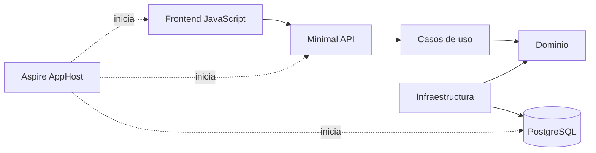

# Delivery Board - Starter de la sesión 5

Aplicación formativa para practicar un ciclo de cambio con BMad Method, OpenSpec, Engram y Codex sobre una arquitectura con frontend, API, casos de uso, dominio, persistencia y pruebas.

El starter conserva intencionadamente el hueco del taller: existen los estados `Pending`, `InProgress` y `Completed`, pero no existe una operación para avanzar una tarea ni una acción equivalente en el frontend.

## Camino rápido

Desde una **copia personal** de este proyecto:

```powershell
./scripts/validate-session-05.ps1 -Baseline
./scripts/install-bmad.ps1
npx --yes bmad-method@6.11.0 status
```

Después reinicia Codex, recupera el contexto del proyecto y sigue la [guía del ejercicio](../../ejercicio/README.md).

## Qué incluye

- **Frontend:** HTML, CSS y JavaScript sin frameworks.
- **API:** Minimal APIs con .NET 10 y C# 14.
- **Aplicación:** casos de uso explícitos, sin MediatR.
- **Dominio:** entidad, reglas de negocio y contrato del repositorio.
- **Infraestructura:** Entity Framework Core, migraciones y PostgreSQL.
- **Pruebas:** xUnit con repositorios fake locales en las pruebas actuales.
- **Orquestación técnica:** .NET Aspire levanta PostgreSQL, API y frontend.
- **SDD:** OpenSpec, skills del proyecto y `scripts/validate-sdd.ps1`.
- **Memoria:** Engram configurado como MCP de proyecto.
- **Contexto:** mapa verificado y baseline explícito en `context/`.



## BMad Method no viene instalado

El material canónico no contiene `_bmad/`, `_bmad-output/` ni las skills BMad generadas. La instalación reproducible forma parte del ejercicio y debe realizarse dentro de la copia personal:

```powershell
npx --yes bmad-method@6.11.0 install --directory . --modules bmm --tools codex --yes
```

Comprobar el estado:

```powershell
npx --yes bmad-method@6.11.0 status
```

**BMad Method** es el método ágil que utilizaremos con el módulo **BMM**. **BMAD Core** es el framework y la CLI subyacentes; no es el nombre del método completo.

BMM base no incluye un agente QA separado. En esta sesión QA es una responsabilidad de verificación mediante desarrollo, checkpoints, revisión de código y pruebas. Test Architect/TEA es un módulo externo y queda fuera de alcance.

## Contexto y memoria

Antes de iniciar un workflow:

1. lee `AGENTS.md`;
2. revisa `context/PROJECT_CONTEXT.md` y `context/BASELINE.md`;
3. recupera memorias relevantes de Engram;
4. contrasta cualquier memoria con el repositorio actual;
5. utiliza `$bmad-project-context` sin sobrescribir decisiones verificadas de forma automática.

OpenSpec conserva especificaciones versionadas. Engram conserva decisiones y aprendizajes recuperables. BMad Method organiza responsabilidades, workflows y artefactos. Ninguna de estas herramientas reemplaza al código como fuente de verdad del comportamiento actual.

## Gates de trabajo

| Gate | Condición para continuar |
|---|---|
| Baseline | OpenSpec, build, tests y comprobaciones de cambios rastreados/no rastreados pasan antes de instalar o editar |
| Producto | Comportamiento, errores y criterios están aprobados |
| Arquitectura | Impactos y contratos están aprobados cuando el cambio lo requiere |
| Construcción | Work units pequeños y verificables están autorizados |
| Aceptación | Checkpoint, revisión, pruebas y escenario funcional tienen evidencia |

Un nombre de rol no prueba aislamiento, paralelismo ni autonomía. La evidencia está en los artefactos, los handoffs, los límites de autoridad y las comprobaciones.

## Requisitos

- Node.js 20.12 o superior.
- `uv` disponible en `PATH`.
- Git para completar el ejercicio y preparar la entrega.
- Un cliente Codex compatible que cargue las skills de proyecto desde `.agents/skills`.
- Python 3.11 o superior recomendado para el aula, no obligatorio para instalar.
- .NET SDK 10.
- Node.js 20 o superior para el frontend.
- Docker Desktop o motor compatible para Aspire.
- OpenSpec disponible para validar los artefactos.
- Engram disponible en `PATH`.

La README etiquetada v6.11.0 enumera Python 3.10+ y `uv`; la guía actual aclara que `uv` puede provisionar el intérprete. El script advierte si no encuentra Python 3.11+, pero no bloquea. El target `--tools codex` prepara `.agents/skills` sin exigir Codex CLI en `PATH`; para realizar la sesión abre después un cliente Codex compatible desde esta carpeta.

## Configurar Engram

Edita `.codex/config.toml` en tu copia y cambia `delivery-board-estudiante` por `delivery-board-<github-login>`. Reinicia Codex desde esta carpeta.

```powershell
engram version
engram stats
codex
```

No versions bases SQLite, tokens, credenciales ni rutas privadas.

## Validar

Antes de instalar BMad:

```powershell
./scripts/validate-session-05.ps1 -Baseline
```

Después de instalar y completar el ejercicio:

```powershell
./scripts/validate-session-05.ps1
```

No existe `bmad validate`. El script final exige el manifiesto y BMM 6.11.0, valida la salida útil de `status` y después ejecuta las comprobaciones reales del proyecto, incluidos los archivos textuales no rastreados.

## Ejecutar con Aspire

```powershell
cd backend
dotnet tool restore
dotnet run --project apphost/DeliveryBoard.AppHost
```

El panel de Aspire permite abrir el frontend y consultar los logs. El frontend utiliza `http://localhost:3000`; la documentación interactiva de la API está en `/swagger` del recurso `api`.

## Endpoints del baseline

| Método | Ruta | Uso |
|---|---|---|
| `GET` | `/health` | Comprueba que la API responde |
| `GET` | `/api/work-items/dashboard` | Devuelve tareas y totales |
| `POST` | `/api/work-items` | Crea una tarea |

No existe todavía un endpoint para cambiar el estado. Definirlo e implementarlo forma parte del taller.

## Decisiones intencionadas

- No hay autenticación porque el foco está en el flujo de desarrollo.
- No hay pruebas del frontend; la comprobación de esa frontera es manual en esta sesión.
- Los casos de uso dependen de `IWorkItemRepository` y pueden probarse sin PostgreSQL.
- Las pruebas actuales utilizan repositorios fake, no Moq.
- La política CORS abierta sirve únicamente para ejecución local formativa.
- No se incorporan MediatR, AutoMapper ni servicios de dominio sin una necesidad aprobada.
- El starter no incluye BMad instalado para evitar vendorizar una copia que pueda quedar desactualizada.
