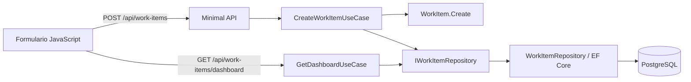

# Contexto verificado de Delivery Board

> Verificado contra el starter de la sesión 5. El código y las especificaciones versionadas prevalecen si este resumen queda desactualizado.

## Propósito

Delivery Board permite crear tareas y consultar un tablero con el total de trabajo y los conteos por estado. Es una aplicación local formativa diseñada para practicar cambios que atraviesan frontend, API, casos de uso, dominio y persistencia sin añadir complejidad empresarial innecesaria.

## Módulos y responsabilidades

| Módulo | Responsabilidad | Puede depender de |
|---|---|---|
| Frontend | Crear tareas, consultar el dashboard y representar la interfaz | Contrato HTTP de la API |
| Api | Exponer Minimal APIs, traducir HTTP y componer dependencias | Application e Infrastructure durante la composición |
| Application | Ejecutar casos de uso y mapear contratos de entrada/salida | Domain |
| Domain | Proteger entidades, estados, prioridades, invariantes y contratos de repositorio | Ningún otro proyecto |
| Infrastructure | Implementar persistencia con EF Core y PostgreSQL | Domain y contratos que implementa |
| AppHost | Levantar PostgreSQL, API y frontend para desarrollo local | Recursos de ejecución |

## Dependencias prohibidas

- Domain no depende de Application, Infrastructure ni Api.
- Application no depende de Infrastructure ni Api.
- El frontend no accede directamente a PostgreSQL.
- La API no debe contener reglas de transición que pertenecen al dominio.
- No se incorporan MediatR, AutoMapper, autenticación o servicios de dominio sin una decisión explícita.

## Entidad e invariantes

`WorkItem` contiene:

- `Id`;
- `Title`, obligatorio y recortado;
- `Owner`, obligatorio y recortado;
- `Priority`: `Low`, `Medium` o `High`;
- `Status`: `Pending`, `InProgress` o `Completed`;
- `CreatedAt`.

Una tarea nueva comienza siempre en `Pending`. El starter declara los tres estados, pero todavía no contiene un método para avanzar entre ellos.

## Flujo principal existente

## Contratos relevantes

| Contrato | Estado actual |
|---|---|
| `POST /api/work-items` | Crea una tarea desde título, responsable y prioridad |
| `GET /api/work-items/dashboard` | Devuelve tareas y conteos por estado |
| `IWorkItemRepository.AddAsync` | Persiste una tarea nueva |
| `IWorkItemRepository.GetAllAsync` | Recupera las tareas ordenadas por creación |
| `BusinessRuleException` | Se traduce a `422 Unprocessable Entity` mediante `ProblemDetails` |

No existe todavía un contrato para recuperar una tarea por identificador, guardar una transición ni avanzar el estado mediante HTTP.

## Persistencia

Entity Framework Core configura `WorkItem` en la tabla `work_items`. `Priority` y `Status` se convierten a texto en PostgreSQL. Los tres estados ya caben en el esquema actual; el ticket de la sesión no necesita una migración por el mero hecho de cambiar el valor de `Status`.

## Pruebas y validaciones

- `CreateWorkItemUseCaseTests` comprueba creación correcta y prioridad desconocida.
- `GetDashboardUseCaseTests` comprueba los conteos del dashboard.
- Las pruebas actuales utilizan implementaciones locales `FakeWorkItemRepository`; Moq no está instalado.
- `scripts/validate-sdd.ps1` valida OpenSpec, compila, ejecuta pruebas y comprueba `git diff --check`.
- `scripts/validate-session-05.ps1` exige manifiesto y BMM 6.11.0, valida la salida útil de `status` y comprueba también archivos textuales no rastreados.

## Riesgos conocidos

- El frontend no muestra actualmente el estado de cada tarea, aunque sí muestra los conteos globales.
- No existe operación de repositorio para buscar por identificador ni persistir una entidad modificada.
- Una transición implementada solo en el endpoint o en JavaScript rompería la autoridad del dominio.
- BMM base no aporta un agente QA separado; la evidencia debe provenir de checkpoints, revisión y pruebas.
- `$bmad-build` puede autoaplicar `patch` y realizar loopbacks acotados por `bad_spec`; `intent_gap` conserva la decisión humana.
- Una memoria o artefacto generado puede quedar obsoleto y debe contrastarse con el repositorio.
- La política CORS abierta y la ausencia de autenticación son decisiones locales formativas, no patrones de producción.
